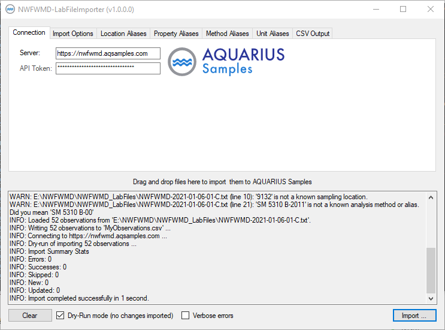

# NWFWMD-LabFileImporter

Download the [latest NWFWMD-LabFileImporter.exe release here](../../../../../releases/latest)

Import lab files to AQUARIUS samples.

The `NWFWMD-LabFileImporter` tool is a standalone .NET console utility for importing lab observerations from a text file an AQUARIUS Samples system. This tool was developed for the Northwest Florida Water Management District.

## Console-mode or GUI-supported

When your command line supplies enough options to the tool that it knows which lab files files to load and which AQUARIUS Samples server to talk with, the tool just runs as console utility, does it work, and exits.

If no text files are specified (or if the `/LaunchGui=true` option is specified), a small GUI window will be launched:
- You can inspect/change most of the configured options.
- You can drag-and-drop text files onto the GUI window and automatically import the results into AQUARIUS Samples.



## Requirements

- The .NET 4.7 runtime is required, which is pre-installed on all Windows 10 and Windows Server 2016 systems, and on nearly all up-to-date Windows 7 and Windows Server 2008 systems.
- No installer is needed. It is just a single .EXE which can be run from any folder.

### Command line option syntax

All command line options are case-insensitive, and support both common shell syntaxes: either `/Name=value` (for CMD.EXE) or `-Name=value` (for bash and PowerShell).

In addition, the [`@options.txt` syntax](https://github.com/AquaticInformatics/examples/wiki/Common-command-line-options) is supported, to read options from a text file. You can mix and match individual `/name=value` and `@somefile.txt` on the same command line.

Try the `/help` option for a detailed list of options and their default values.

## Authentication with AQUARIUS Samples

Two options are required to tell the tool how to access your AQUARIUS Samples instance.

- The `/ServerUrl=` option sets the URL to the server, usually something like `/ServerUrl=https://mydomain.aqsamples.com`.
- The `/ApiToken=` option sets the API token used to authenticate your account. Navigate to https://[your_account].aqsamples.com/api/ and follow the instructions to get the token.

### Alias options

The tool allows for several properties to be "aliased", allowing your external system to refer to these items by different names, but still map them to the correct AQUARIUS Samples items.

- The `/LocationAlias=externalName;SamplesName` option will map between external and Samples sampling location IDs.
- The `/AnalysisMethodAlias=externalName;SamplesName` option will map between external and Samples Analysis Method IDs.
- The `/UnitAlias=externalName;SamplesName` option will map between external and Samples unit IDs.
- The `/ObservedPropertyAlias=externalName;SamplesName` option will map between external and Samples observed property IDs.
- Semi-colons separate the mapped values. Whitespace surrounding the semicolons will be ignored.

As the importer tool is parsing the text files, any locations or observed properties that match a defined alias will be substituted accordingly. If no alias is found, the value from the file will be used for lookup.

It is recommended to use the `@options.txt` approach to store all of your aliases in a text file, for simpler maintenance.

This example command line stores the Samples credentials and the aliases in separate text files and then uses `@` references to combine them together.
```cmd
C:\NWFWMD-LabFileImporter> NWFWMD-LabFileImporter.exe @Credentials.txt @LocationAliases.txt @PropertyAliases.txt NWFWMD-2021-07-22-01-C.txt
```

### CSV Output options

The importer tool will normally upload the imported observations directly to AQUARIUS Samples, without saving any files locally.

But you can also use the `/CsvOutputPath=` option to write the observations to a local CSV file, which is useful if you want to inspect the imported data and make manual corrections.

- When no `/ServerUrl=` or `/ApiToken=` option is specified, the tool will attempt to write its observations to a CSV file.
- If not explicit `/CsvOutputPath=` option is specified, a file named `Observations-yyyyMMddHHmmss.csv` will be created in the same folder as the EXE.
- The `/CsvOutputPath=` option specifies the where to write the CSV file.
- The `/Overwrite=` option can be set to true if you want to allow an existing CSV file to be overwritten.

## Test your files with `/DryRun=true` or `/N` before actually uploading anything.

The importer supports a "dry-run" preview mode, importing the observations to AQUARIUS Samples just for validation, and reporting any errors which need to be corrected.

By default, only the first 10 errors are shown, but this can be controlled with the `/ErrorLimit=` option.

### `/help` screen

```
Import lab file results as AQUARIUS Samples observations.

usage: NWFWMD-LabFileImporter [-option=value] [@optionsFile] labFile ...

Supported -option=value settings (/option=value works too):

  ========================= AQSamples connection options: (if set, imported lab results will be uploaded)
  -ServerUrl                AQS server URL
  -ApiToken                 AQS API Token

  ========================= File parsing options:
  -File                     Parse the text file as lab file results.
  -StopOnFirstError         Stop on first error? [default: False]
  -ErrorLimit               Maximum number of errors shown. [default: 10]
  -UtcOffset                UTC offset for imported times [default: Use system timezone, currently -07:00]
  -StartTime                When set, only include observations after this time.
  -EndTime                  When set, only include observations before this time.

  ========================= Import options:
  -DryRun                   Enable a dry-run of the import? /N is a shorthand. [default: False]
  -MaximumObservations      When set, limit the number of imported observations.
  -ResultGrade              Result grade when value is not estimated. [default: OK]
  -LabResultStatus          Lab result status. [default: Preliminary]
  -DefaultLaboratory        Default laboratory ID for lab results
  -DefaultMedium            Default medium for results [default: Water]
  -NonDetectCondition       Lab detect condition for non-detect events. [default: Non-Detect]
  -VerboseErrors            Show row-by-row errors? [default: False]

  ========================= Alias options: (these help you map from your external system to AQUARIUS Samples)
  -LocationAlias            Set a location alias in aliasedLocation;SamplesLocationId format
  -ObservedPropertyAlias    Set an observed property alias in aliasedProperty;SamplesObservedPropertyId format
  -AnalysisMethodAlias      Set an analysis method alias in aliasedMethod;SamplesMethodId format
  -UnitAlias                Set a unit alias in aliasedUnit;SamplesUnitId format

  ========================= CSV output options:
  -CsvOutputPath            Path to output file. If not specified, no CSV will be output.
  -Overwrite                Overwrite existing files? [default: False]

  ========================= GUI options:
  -LaunchGui                Launch in GUI mode? (Automatic when no input files are specified.)

Use the @optionsFile syntax to read more options from a file.

  Each line in the file is treated as a command line option.
  Blank lines and leading/trailing whitespace is ignored.
  Comment lines begin with a # or // marker.
```