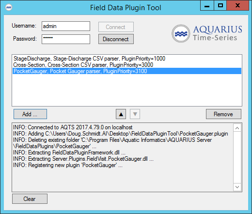

# FieldDataPluginTool

The Field Data Plugin tool is a utility that can be used to install and configure Field Data Plugins on your AQTS app server.

## Features
- Can add, remove, or change priority of field data plugins.
- Supports drag-and-drop installation of plugins.
- Operator confirmation is required before any changes are made.
- All actions are logged in the standard `%ProgramData%\Aquatic Informatics\AQUARIUS\Logs` folder in the `FieldDataPluginTool.log` file.

## Requirements

- The tool must be run directly on an AQTS app server, running 2017.4-or-newer software.
- Administrative access is required.
- The Time-Series server software must be running.

## The `*.plugin` file format

Field data plugin developers can bundle their plugins in a "*.plugin" file. These files can be installed by clicking the "Add ..." button or by dragging the `*.plugin` file onto the tool's plugin list.

A `*.plugin` file is a ZIP archive containing:
- A `manifest.json` file, which includes the **PluginFolderName**, **Description**, and **AssemblyQualifiedTypeName** string properties. These values are set by the plugin developer and should not need to be changed when a plugin is installed on an AQTS system.
- All other files in the ZIP archive, including any nested folders and files, will be copied to the named folder when the plugin is installed.

A bare-minimum `*.plugin` file contains 3 files:
- The common `FieldDataPluginFramework.dll` assembly
- The actual plugin assembly implementing the `IFieldDataPlugin` interface
- The `manifest.json` file
 
### ERROR: This tool only works on AQTS 201x (Detected server=Unknown).

This error will be shown when you try to run the tool with Administrative rights from a network drive. The standard Windows security restrictions will not allow admin tools to be run from a network drive.

Work around this restriction by running the tool from a folder on the app server.
