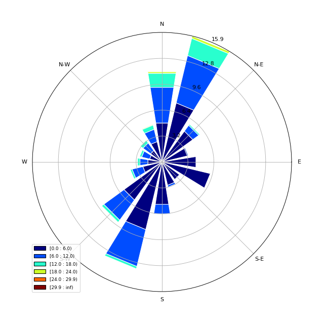

## Wind rose plots

[**Download** this project folder](https://minhaskamal.github.io/DownGit/#/home?url=https:%2F%2Fgithub.com%2FAquaticInformatics%2FExamples%2Ftree%2Fmaster%2FTimeSeries%2FPublicApis%2FPython%2FWindRose)

This script can be used to plot a wind rose diagram from a wind speed and wind direction time-series pair.

## Requirements

```python
pip install pandas matplotlib windrose
```

## Configuration

All the configuration options are set at the top of the `AQTS-WindRose.py` file.

```python
# Configure your data here
config = dict(
    server="youraqtsserver", username="admin", password="admin",        # AQTS credentials for your server
    windSpeedSeriesName="Wind Vel.Work@01372058",                       # The wind-speed time-series name
    windDirectionSeriesName="Wind Dir.Work@01372058",                   # The wind-direction time-series name
    eventPeriodStartDay="2011-01-01", eventPeriodEndDay="2011-12-31",   # The event period to analyze
    uploadedReportTitle="Wind Rose",                                    # The title of the uploaded report
    removeDuplicateReports=True)                                        # Set to True to avoid duplicate reports in WebPortal
```


| Property | Required? | Description |
| ---|---|--- |
| server | Yes |The AQTS server name, as a DNS name, or an IP address string. If no scheme is supplied, `http://` will be used. |
| username, password | Yes | The AQTS credentials to use to retrieve data. |
| windSpeedSeriesName | Yes| The time-series to analyze. |
| windDirectionSeriesName | Yes| The time-series to analyze. |
| eventPeriodStartDay, eventPeriodEndDay | Yes | Defines the event period to analyze. |
| uploadedReportTitle | No | When set, the output will be uploaded as a PDF to AQTS as an external report with the supplied title. |
| removeDuplicateReports | No | If omitted or `False`, no existing reports on the AQTS server will be modified.<br/><br/>Set this option to `True` to remove any existing reports with the same name as `uploadedReportTitle` before the new report is uploaded.<br/><br/>This option is useful for AQUARIUS WebPortal deployments, to automatically simplify the list of publicly visible reports. |


## Sample output

