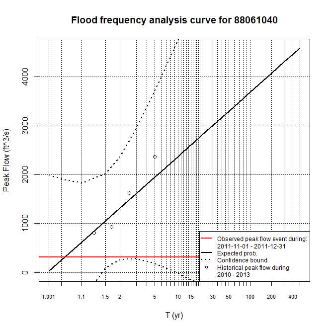

[**Download** this project folder](https://minhaskamal.github.io/DownGit/#/home?url=https:%2F%2Fgithub.com%2FAquaticInformatics%2FExamples%2Ftree%2Fmaster%2FTimeSeries%2FPublicApis%2FR%2FFloodFrequencyAnalysis)

This script can be used to plot the Flood Frequency Analysis (FFA) curve for a time-series, comparing an event period against a set of historical values.

## Requirements

```R
install.packages("zoo")
install.packages("mgcv")
```

## Configuration

All the configuration options are set at the top of the `AQTS-FFA-curves.R` file.

```R
# Configuration values for this script
config = list(
  server = "youraqtsserver", username = "admin", password = "admin",    # AQTS credentials for your server
  timeSeriesName = "Discharge.ft^3/s.comp.ref@88061040",                # The time-series to analyze
  historicalPeriodStartYear = 2010, historicalPeriodDurationYears = 4,  # The historical period to analyze
  eventPeriodStartDay = "2011-11-01", eventPeriodEndDay = "2011-12-31", # The event period to analyze
  uploadedReportTitle = "Flood Frequency Analysis",                     # The title of the uploaded report
  removeDuplicateReports = TRUE,                                        # Set to TRUE to avoid duplicate reports in WebPortal
  cachedHistoricalDataPath = "ffaData.rda")                             # When set, use the data in this file to avoid a lengthy recalculation
```

| Property | Required? | Description |
| ---|---|--- |
| server | Yes |The AQTS server name, as a DNS name, or an IP address string. If no scheme is supplied, `http://` will be used. |
| username, password | Yes | The AQTS credentials to use to retreieve data. |
| timeSeriesName | Yes| The time-series to analyze for peak flow. |
| historicalPeriodStartYear, historicalPeriodDurationYears | Yes | Defines the historical period against which the event period is compared. |
| eventPeriodStartDay, eventPeriodEndDay | Yes | Defines the event period to analyze for peak flow. |
| uploadedReportTitle | No | When set, the output will be uploaded as a PDF to AQTS as an external report with the supplied title. |
| removeDuplicateReports | No | If omitted or `FALSE`, no existing reports on the AQTS server will be modified.<br/><br/>Set this option to `TRUE` to remove any existing reports with the same name as `uploadedReportTitle` before the new report is uploaded.<br/><br/>This option is useful for AQUARIUS WebPortal deployments, to automatically simplify the list of publicly visible reports. |
| cachedHistoricalDataPath | No | If omitted or an empty string, the historical record will be retrieved and reprocessed every time the script is run.<br/><br/> But if the property is set to a filename, the script will only process the historical data once, saving its results to the file. Subsequent runs will quickly load the precomputed historical data from the file. |

## Operation

Computing the peak flow values of the historical record can be a slow process.

The script allows you to avoid always recomputing the historical record by setting the `cachedHistoricalDataPath` property to a path on disk.
When the property is set, the historical record will only be retrieved and processed once. Subsequent runs will reuse the precomputed historical record.

To always recalculate the historical record, simply omit the `cachedHistoricalDataPath` property or set it to an empty string.

## Sample output


