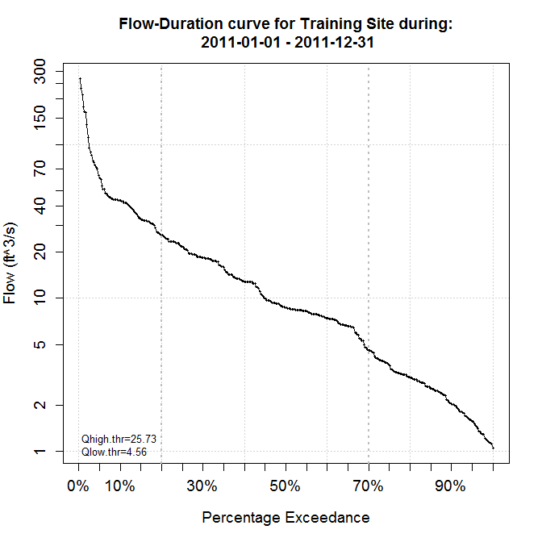
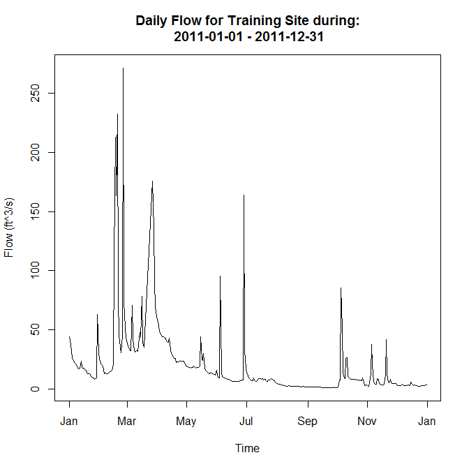

[**Download** this project folder](https://minhaskamal.github.io/DownGit/#/home?url=https:%2F%2Fgithub.com%2FAquaticInformatics%2FExamples%2Ftree%2Fmaster%2FTimeSeries%2FPublicApis%2FR%2FFlowDurationCurve)

This script can be used to plot the Flow Duration Curve for a time-series.

## Requirements

```R
install.packages("hydroTSM")
install.packages("zoo")
install.packages("Rcpp")
install.packages("mgcv")
```

## Configuration

All the configuration options are set at the top of the `AQTS-FDC.R` file.

```R
# Configuration values for this script
config = list(
  server = "youraqtsserver", username = "admin", password = "admin",    # AQTS credentials for your server
  timeSeriesName = "Discharge.ft^3/s.comp.ref@88061040",                # The time-series to analyze
  eventPeriodStartDay = "2011-01-01", eventPeriodEndDay = "2011-12-31", # The event period to analyze
  uploadedReportTitle = "Flood Frequency Analysis",                     # The title of the uploaded report
  removeDuplicateReports = TRUE)                                        # Set to TRUE to avoid duplicate reports in WebPortal
```

| Property | Required? | Description |
| ---|---|--- |
| server | Yes |The AQTS server name, as a DNS name, or an IP address string. If no scheme is supplied, `http://` will be used. |
| username, password | Yes | The AQTS credentials to use to retreieve data. |
| timeSeriesName | Yes| The time-series to analyze for flow duration. |
| eventPeriodStartDay, eventPeriodEndDay | Yes | Defines the event period to analyze. |
| uploadedReportTitle | No | When set, the output will be uploaded as a PDF to AQTS as an external report with the supplied title. |
| removeDuplicateReports | No | If omitted or `FALSE`, no existing reports on the AQTS server will be modified.<br/><br/>Set this option to `TRUE` to remove any existing reports with the same name as `uploadedReportTitle` before the new report is uploaded.<br/><br/>This option is useful for AQUARIUS WebPortal deployments, to automatically simplify the list of publicly visible reports. |

## Sample output


