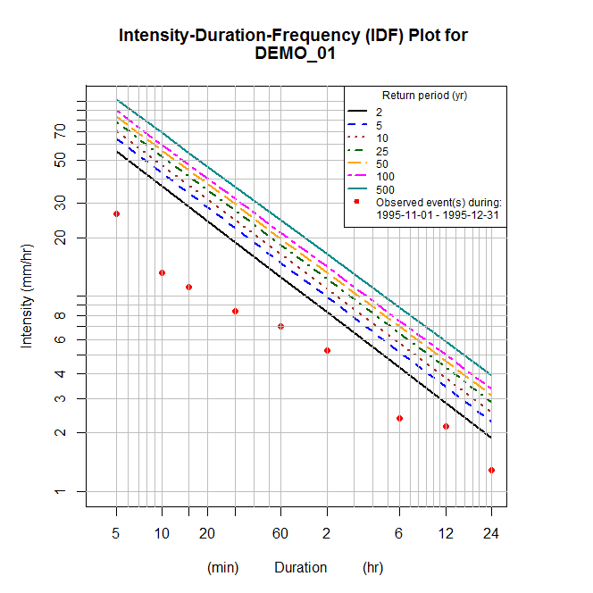
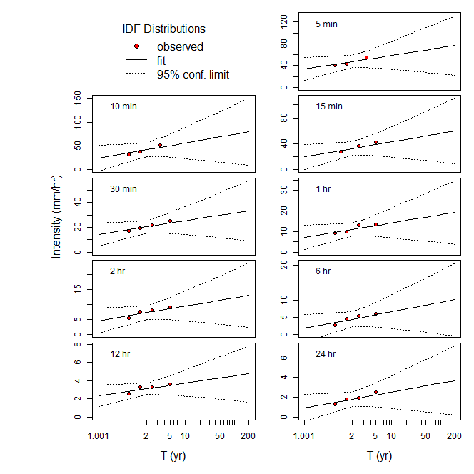

## Intensity Duration Frequency

[**Download** this project folder](https://minhaskamal.github.io/DownGit/#/home?url=https:%2F%2Fgithub.com%2FAquaticInformatics%2FExamples%2Ftree%2Fmaster%2FTimeSeries%2FPublicApis%2FR%2FIntensityDurationFrequency)

This script can be used to plot the Intensity Duration Frequency (IDF) for a time-series, comparing an event period against a set of historical values.

## Requirements

```R
install.packages("zoo")
install.packages("mgcv")
```

## Configuration

All the configuration options are set at the top of the `AQTS-IDF-curves.R` file.

```R
# Configuration values for this script
config = list(
  server = "youraqtserver", username = "admin", password = "admin",     # AQTS credentials for your server
  timeSeriesName = "Precipitation.Historic@DEMO_01",                    # The time-series to analyze
  historicalPeriodStartYear = 1995, historicalPeriodDurationYears = 4,  # The historical period to analyze
  eventPeriodStartDay = "1995-11-01", eventPeriodEndDay = "1995-12-31", # The event period to analyze
  cachedHistoricalDataPath = "idfData.rda")                             # When set, use the data in this file to avoid a lengthy recalculation
```

## Operation

Computing the intensity values of the historical record can be a slow process.

The script allows you to avoid always recomputing the historical record by setting the `cachedHistoricalDataPath` property to a path on disk.
When the property is set, the historical record will only be retrieved and processed once. Subsequent runs will reuse the precomputed historical record.

To always recalculate the historical record, simply omit the `cachedHistoricalDataPath` property or set it to an empty string.

## Sample output



