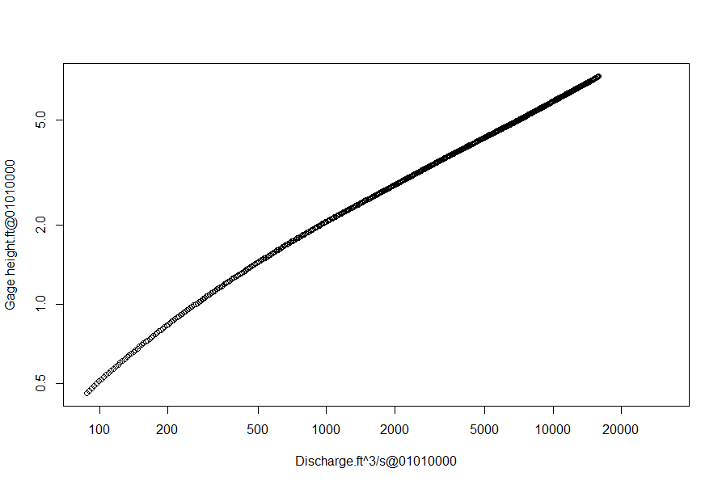
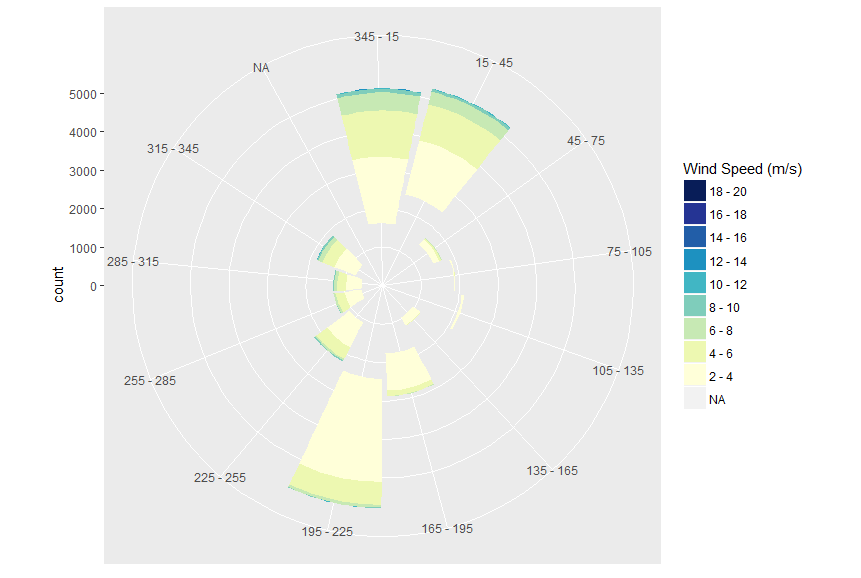

## Consuming AQUARIUS Time-Series data from R

The R programming environment provides a rich ecosystem for numerical computing and graphic visualization.

Requires:
- [an R runtime](https://cran.rstudio.com/) 3.3-or-greater, any supported platform
- AQTS 2017.2 or later - To get time-aligned time-series data

### Recommended packages

Before consuming any data from AQTS, you'll need to be able issue HTTP requests to the public APIs and serialize data to/from JSON.

Install these packages to enable basic communication with your AQTS server from your R environment.
```R
> install.packages("jsonlite") # Fast JSON parser
> install.packages("httr") # Hadley's nice HTTP requests library
```

#### Capturing HTTP requests from R using Fiddler

[Fiddler](http://www.telerik.com/fiddler) is a great tool for capturing HTTP traffic on Windows systems.

You will need to manually configure your R environment to route its HTTP requests through the Fiddler proxy in order to the traffic in the Fiddler window.

```R
# The following tells R to use the default Fiddler endpoint as its HTTP proxy
> Sys.setenv(http_proxy="http://localhost:8888")

# And this disables the proxy (required if Fiddler is no longer running)
> Sys.setenv(http_proxy="")
```

Other R platforms like Linux and OS X have similar debugging proxy tools available, and will need to be manually configured using the `Sys.setenv()` method.

## The `timeseries_client.R` API wrapper

The [`timeseries_client.R`](./timeseries_client.R) file adds some objects and method to communicate with the public REST APIs of an AQTS system.

### Loading the wrapper into your workspace

```R
# Load the wrapper into your workspace
> source("timeseries_client.R")
```

A `timeseries` object will be added to your workspace.

### Authenticating with AQTS

Authenticate with your AQTS server using the `connect` method of the `timeseries` object, passing your AQTS credentials.
```R
# Connects to http://myserver/AQUARIUS as "myuser"
> timeseries$connect("myserver", "myusername", "mypassword")
```

All subsequent requests to the AQTS server will use the authenticated session.

### Disconnecting from AQTS

Your authenticated AQTS session will expire one hour after the last authenticated request made.

Your code can choose to immediately disconnect from AQTS by calling the `disconnect` method of the `timeseries` object.

```R
> timeseries$disconnect()
# The next request will fail with 401: Unuathorized
> timeseries$getTimeSeriesUniqueId("Stage.Label@Location")
Error Unauthorized (HTTP 401) ...
```

### Error handling

Any errors contained in the HTTP response will be raised through the `stop_for_status()` method from the `httr` package.

Your code can use standard R error handling techniques (like the `trycatch()` method) to handle errors as you'd like.

## Example 1 - Plotting Stage vs. Discharge

The first step is simply to connect to AQTS and grab a year's worth of data for a stage/discharge pair.

```R
# Connect to AQTS
> timeseries$connect("myserver", "admin", "admin")

# Get the time-sligned data for the year 2012 for a discharge and stage time-series
> json = timeseries$getTimeSeriesData(c("Discharge.Working@Location","Stage.Working@Location"),
                                      queryFrom = "2012-01-01T00:00:00Z",
                                      queryTo   = "2013-01-01T00:00:00Z")
```
Now the points are in R data frames in the `json` object, so we can simply plot them as an XY plot.
```R
# Plot stage vs. discharge, in logspace, with labeled axis
> plot(json$Points$NumericValue1, json$Points$NumericValue2, log = "xy",
       xlab = json$TimeSeries$Identifier[1],
       ylab = json$TimeSeries$Identifier[2])
```

And here is the plot, which should match the rating curve for 2012.



## Example 2 - Plotting a wind rose diagram

Inspired almost completely by [this StackOverflow post](https://stackoverflow.com/questions/17266780/wind-rose-with-ggplot-r):

The wind rose example requires a few more common R packages to be installed:

```R
> install.packages("ggplot2") # Hadley's declarative "Grammar of Graphics"
> install.packages("scales") # Hadley's nice graphical scaling library
> install.packages("RColorBrewer") # Color schemes for maps & graphics
```

Now you can source the [`wind_rose_ggplot.R`](./wind_rose_ggplot.R) file into your workspace.
```R
> source("wind_rose_ggplot.R")
```

To plot the wind rose, we'll need to pull the 2011 data for both wind speed and direction from a location.

Because the StackOverflow example is expecting wind speed in meters-per-second, we'll need to ask for that time-series to convert its values from mile-per-hour to meters-per-second.

```R
# Grab the wind data for 2011.
> json = timeseries$getTimeSeriesData(
      c("Wind speed.mph.Work@01372058", "Wind direction.deg.Work@01372058"),
      outputUnitIds="m/s,",
      queryFrom="2011-01-01T00:00:00Z",
      queryTo=  "2012-01-01T00:00:00Z")
```

Now we plot the points, using the code from the StackOverflow post.

```R
> plot.windrose(spd = json$Points$NumericValue1, dir = json$Points$NumericValue2)
```

Nifty neato!

