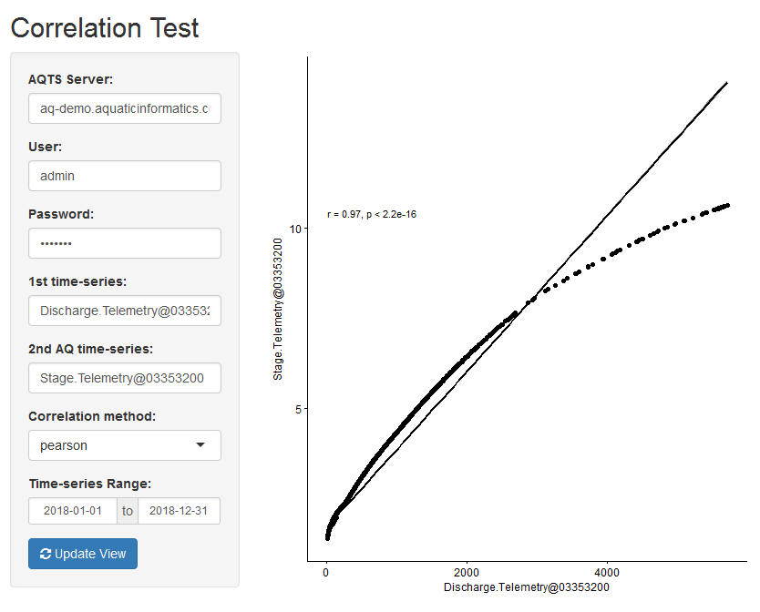

[**Download** this project folder](https://minhaskamal.github.io/DownGit/#/home?url=https:%2F%2Fgithub.com%2FAquaticInformatics%2FExamples%2Ftree%2Fmaster%2FTimeSeries%2FPublicApis%2FR%2FShinyCorrelator)

This R-based Shiny app can be used to show the correlation between two time-series.

## Requirements

```R
install.packages("jsonlite")
install.packages("httr")
install.packages("ggbubr")
```

## Configuration

All the configuration options are set at the top of the `app.R` file.

```R
# Configuration values for this script
config = list(
  server = "youraqtsserver", username = "admin", password = "admin",    # AQTS credentials for your server
  timeSeries1Name = "Discharge.Telemetry@03353200",                     # The 1st time-series to analyze
  timeSeries2Name = "Stage.Telemetry@03353200",                         # The 2nd time-series to analyze
  eventPeriodStartDay = "2018-01-01", eventPeriodEndDay = "2018-12-31") # The period to analyze
```

| Property | Required? | Description |
| ---|---|--- |
| server | Yes |The AQTS server name, as a DNS name, or an IP address string. If no scheme is supplied, `http://` will be used. |
| username, password | Yes | The AQTS credentials to use to retreieve data. |
| timeSeries1Name | Yes| The first time-series to analyze. |
| timeSeries1Name | Yes| The second time-series to analyze. |
| eventPeriodStartDay, eventPeriodEndDay | Yes | Defines the event period to analyze. |

## Sample output


