# SOS proxy for AQUARIUS Time Series

The folks at [52North](https://52north.org/) have released an open-source proxy version of their [SOS Server](https://52north.org/software/software-projects/sos/) project.

This server exposes a OGC-compliant SOS (Sensor Observation Service) facade around your AQUARIUS Time Series server, allowing you to expose your time-series data in the WaterML 2 standard format.

## Advantages over the `SosExporter.exe` tool

- With a quick configuration, the SOS proxy can be told to expose a subset of your time-series data.
- The proxy does not synchronize every time-series point from your AQTS system (which was always very slow and problematic with the SosExporter tool). Instead, it quickly synchronizes the locations and time-series you want to expose.
- All time-series points are retrieved "on-the-fly", as the proxy receives requests for a time-range of points.

## Docker setup

The proxy code is available as a Docker image, and can be started with the following docker command:

```sh
docker run --name sos -p 8080:8080 52north/sos:aq_pr.3
```

Alternatively you can use the [docker_compose.yml](./docker-compose/docker-compose.yml) file and then use the `docker-compose up` command to spin up the proxy behind an nginx instance.

```sh
$ cd docker-compose
$ docker-compose up
Starting docker-compose_sos_1 ... done
Starting docker-compose_proxy_1 ... done
Attaching to docker-compose_sos_1, docker-compose_proxy_1
proxy_1  | /docker-entrypoint.sh: /docker-entrypoint.d/ is not empty, will attempt to perform configuration
proxy_1  | /docker-entrypoint.sh: Looking for shell scripts in /docker-entrypoint.d/
proxy_1  | /docker-entrypoint.sh: Launching /docker-entrypoint.d/10-listen-on-ipv6-by-default.sh
proxy_1  | 10-listen-on-ipv6-by-default.sh: info: Getting the checksum of /etc/nginx/conf.d/default.conf
sos_1    | 2021-07-23 23:53:48.000:INFO:docker-entrypoint:jetty start from /var/lib/jetty/jetty.start
proxy_1  | 10-listen-on-ipv6-by-default.sh: info: /etc/nginx/conf.d/default.conf differs from the packaged version
proxy_1  | /docker-entrypoint.sh: Launching /docker-entrypoint.d/20-envsubst-on-templates.sh
proxy_1  | /docker-entrypoint.sh: Launching /docker-entrypoint.d/30-tune-worker-processes.sh
proxy_1  | /docker-entrypoint.sh: Configuration complete; ready for start up
sos_1    | 2021-07-23 23:53:48.319:INFO::main: Logging initialized @232ms to org.eclipse.jetty.util.log.StdErrLog
```

## First time setup

Browse to `http://localhost` to begin the setup process.

Most of the steps are quick and take only a few seconds, but you will probably spend the most time at step 6, configuring the AQTS-specific settings to filter the appropriate locations and time-series for your system.

### Step 1 - Click the "here" in the upper right corner to begin the SOS setup wizard.

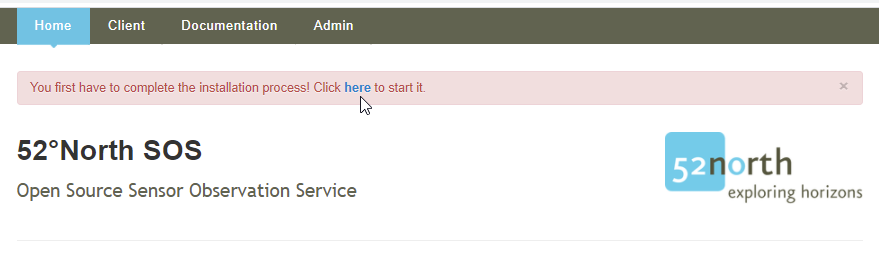

### Step 2 - Click "Start" in the lower right corner

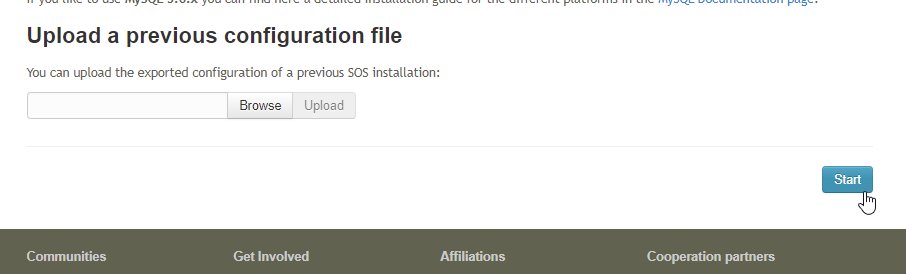

### Step 3 - Select "Proxy Aquarius (in-memory)" as the datasource, then click "Next"

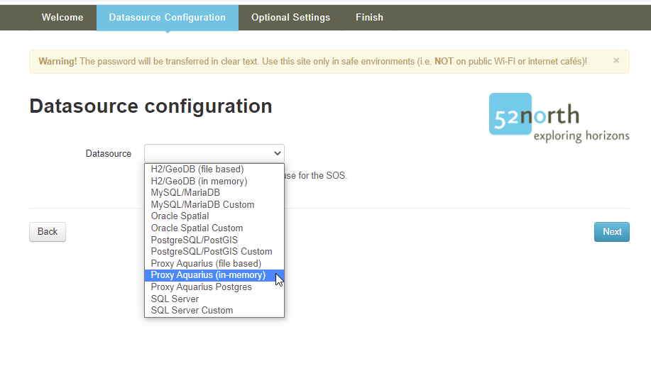

### Step 4 - Enter the AQTS URL and credentials, then click "Next"

Here you will enter the URL of your AQTS server, plus an AQTS credential account and password that the SOS proxy will use to access the AQTS APIs to obtain its data.

It is recommended that the AQTS account is configured for read-only access to the system, to limit the chance that any data will be changed in your core AQTS system.

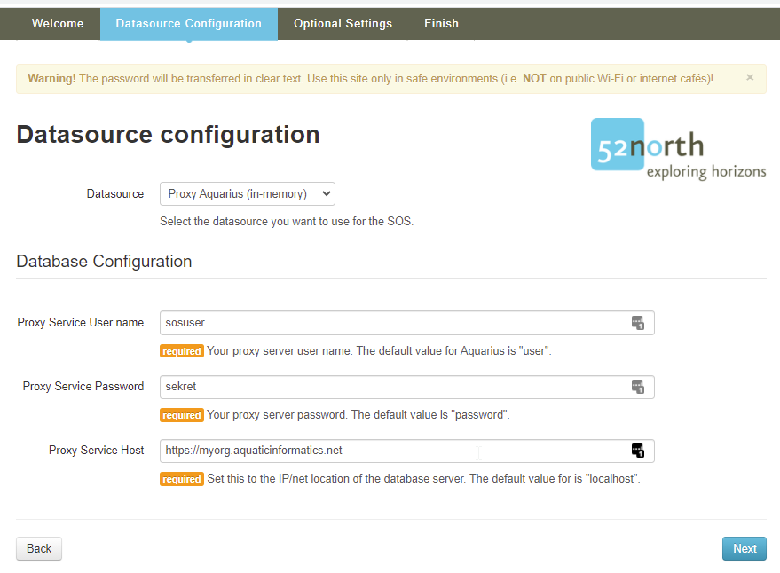

### Step 5 - Configure the "Proxy" settings to control the SOS polling frequency

The "Proxy" setting group has two properties which control the frequency at which the SOS proxy polls the AQTS system for new information.

These properties are [Unix cron expressions](https://www.freeformatter.com/cron-expression-generator-quartz.html#cronconverttotext), which are a common way of configuring periodic operations.

| Property | Default value | Description |
|---|---|---|
| Full Update | `0 0 03 * * ?`<br/>Every day at 3 AM | The full list of exported locations and time-series is refetched from AQTS. A full update takes longer to complete, but will take into account any deleted time-series or locations. |
| Temporal Update | `0 0/5 * * * ?`<br/>Every 5 minutes | And incremental "changes-since" poll of exported locations and time-series. |

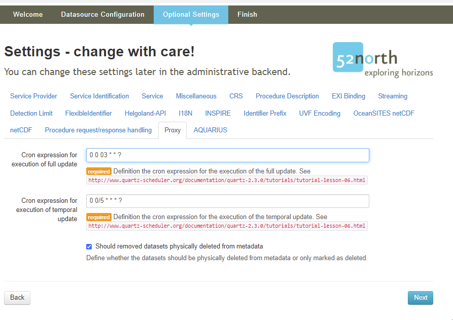

### Step 6 - Configure how time-series points are reported via SOS.

The "AQUARIUS" section of settings includes configuration options for:
- Which signal, corrected points or raw points, is exposed.
- Which AQTS qualifiers, if any, represent below/above sensor detection limits.


### Step 6 - Configure the "AQUARIUS" settings to filter which locations and time-series are exposed via SOS.

This section of settings controls which location and time-series from your AQTS system are exposed and made available for SOS queries.

By default, every location and time-series in your system will be exposed to SOS, but a number of configurable options are available to filter only a subset of locations and time-series.

Two types of filters are configurable:
- Extended attribute filters
- Publish flag filters

When both filters are configured, they will act as an "AND" operation and both conditions must match for a location or time-series to be exposed via SOS.

#### Step 6A - Configure location and/or time-series extended attributes filters

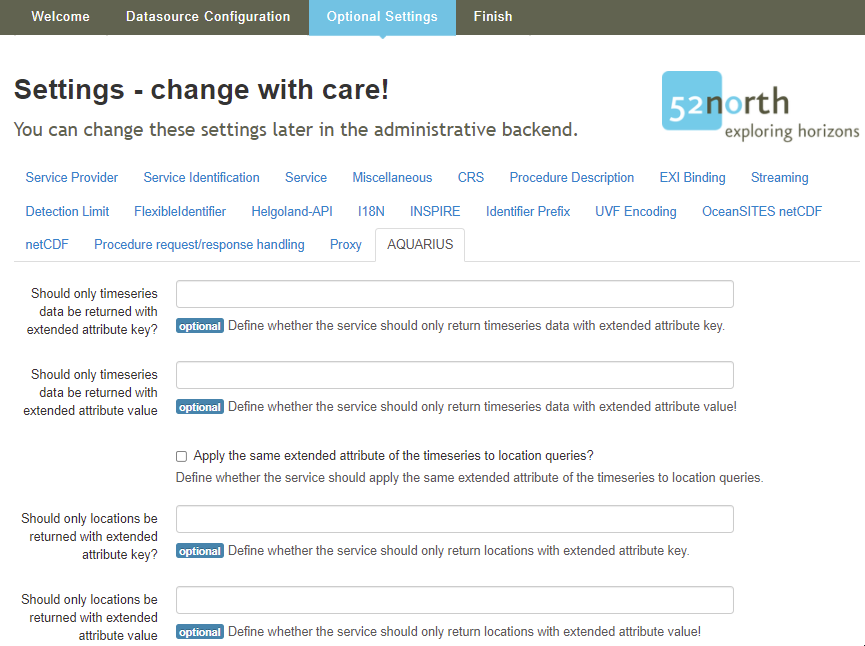

By default, no extended attribute values are used to filter locations or time-series, but many AQTS systems will use specific extended attribute values to indicate that a location or time-series should be exposed to the SOS proxy.

The configuration section allows for:
1) No extended attribute filters at all (the default configuration).
2) Only filter time-series via an extended attribute value (all locations will be exposed).
3) Filter time-series and locations by the same extended attribute value.
4) Filter time-series with one extended attribute value and locations with a different extended attribute value.

For systems that were previously configured to use the `SosExporter.exe`, option 2 makes sense, since the `ExportToSos` time-series extended attribute would have a value of 'Yes' when the series was exposed to SOS.

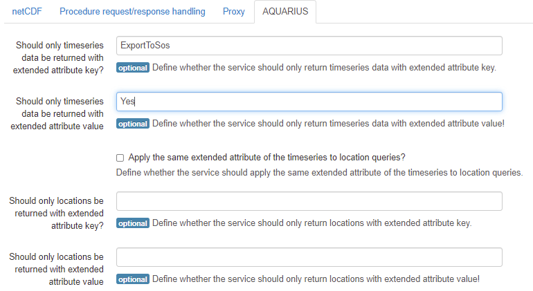

#### Step 6B - Filter by Publish=true or Publish=false

The default configuration is **All** which does not use the location/time-series Publish flag to filter exposed items.

Many AQTS systems use the Publish flag to control which items are exposed to their AQUARIUS Web Portal system, so if you are running both Web Portal and the SOS proxy, you will probably need a different filter (via extended attributes) to limit the data exposed to SOS.

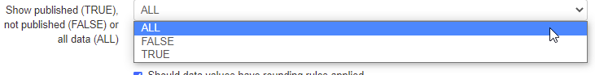

#### Step 6C - Corrected or Raw time-series points

The default configuration is **Corrected** and AQI strongly recommends keeping this default value.

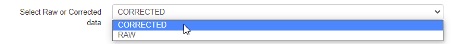

#### Step 6D - Configure qualifiers to indicate above/below sensor detection limits

Many water quality sensors have minimum detection limits, and some have maximum detection limits. The SOS proxy can report WaterML 2 standard above/below sensor limits by configuring the AQTS qualifier used to represent either condition.

When your time-series has points with these qualifiers applied, the SOS points will indicate the appropriate condition.

If your AQTS system uses qualifiers to represent these conditions, then you can enter the identifer of the qualifiers here.

So this AQTS qualifier configuration ...

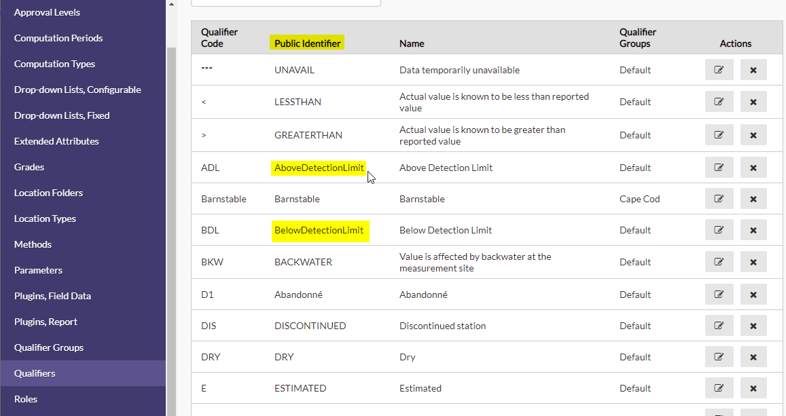

Would be configured like this in the SOS proxy.

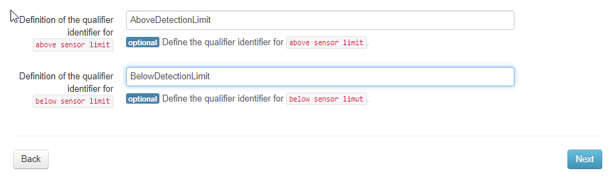

Note that the "Public Identifier" is used, not the "Qualifier Code" (so "AboveDetectionLimit" and not "ADL")

### Step 7 - Click "Next" to complete the Setup Wizard.

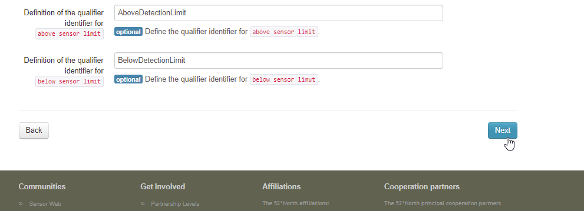

### Step 8 - Add the SOS admin credentials and click "Install"

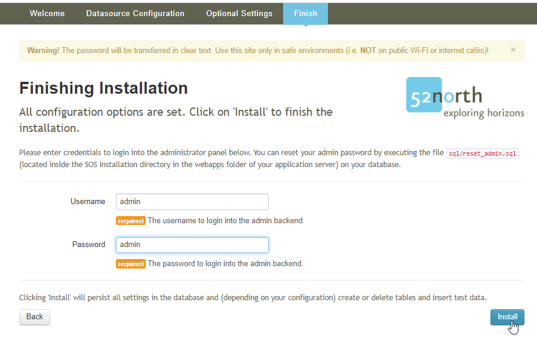

### Step 9 - Login as the SOS admin

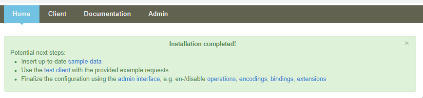

Use the credentials you added in Step 8 to log into the SOS server in the "Admin" menu.

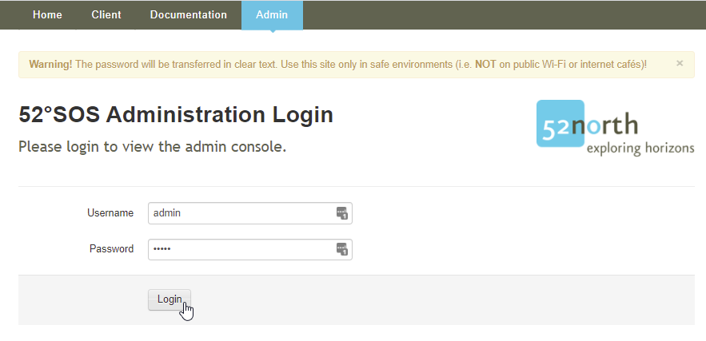

### Step 10 - Select the Admin => Settings => Profiles menut

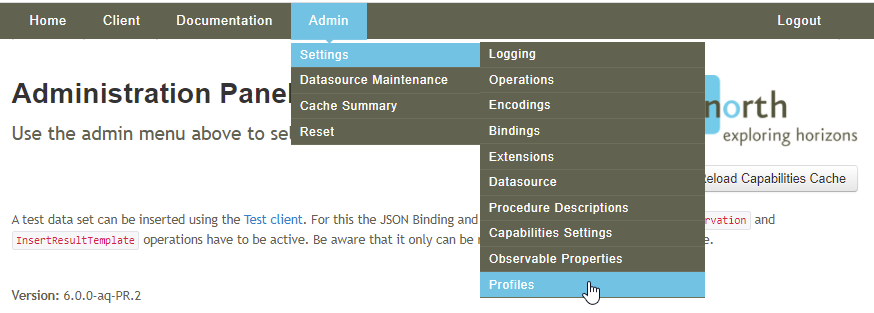

### Step 11 - Select the "hydrology" profile and click "Activate Profile!" to enable WaterML 2 output

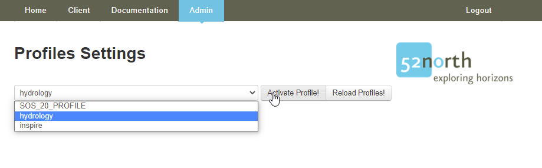