# SOS proxy for AQUARIUS Time Series

The folks at [52North](https://52north.org/) have released an open-source proxy version of their [SOS Server](https://52north.org/software/software-projects/sos/) project.

This server exposes a OGC-compliant SOS (Sensor Observation Service) facade around your AQUARIUS Time Series server, allowing you to expose your time-series data in the WaterML 2 standard format.

## Advantages over the now-deprecated [`SosExporter.exe`](..) tool

- With a quick configuration, the SOS proxy can be told to expose a subset of your time-series data.
- The proxy does not synchronize every time-series point from your AQTS system (which was always very slow and problematic with the SosExporter tool). Instead, it quickly synchronizes the locations and time-series you want to expose.
- All time-series points are retrieved "on-the-fly", as the proxy receives requests for a time-range of points.

## SOS API to Publish API translation

The SOS proxy acts as a transformation layer between the OGC SOS standard and the AQTS Publish API.

By far, the most common OGC SOS request is the [`GetObservation`](https://wiki.52north.org/SensorWeb/GetObservation) request, which can be used to fetch a single observation, or a time-range of observation points. This request is analagous to the `GET /AQUARIUS/Publish/v2/GetTimeSeriesCorrectedData` request.

Every `GetObservation` request received by the SOS proxy will be transformed into an equivalent `/GetTimeSeriesCorrectedData` request on the AQTS Publish API.

## How your AQTS time-series are mapped to SOS sensor observations

| AQTS property | AQTS examples | SOS property | Notes |
|---|---|---|---|
| Time-series identifier | `Stage.Test@Location2` | **offering** | |
| Parameter display name | `Stage` | **observedProperty** | This is the parameter display name, not the parameter ID. So `Stage` instead of `HG`.|
| Interpolation type | `InstantaneousValues` | | (see table below) |
| Location identifier | `Location2` | **featureOfInterest** | |
| Location name | `The second location` | | |
| Location type | `Atmosphere` | **procedure** | |

The AQTS interpolation type (and sometimes its computation identifier) of each exported series is mapped to a WaterML interpolation types (section 9.15.3.2 of the [WaterML2 standard](https://www.ogc.org/standards/waterml)) as follows:

| AQTS Intepolation Type | AQTS Computation Identifier | WaterML2 Interpolation | Notes |
|---|---|---|---|
| InstantaneousValues | | `Continuous` - Continuous | |
| DiscreteValues | | `Discontinuous` - Discontinuous | |
| InstantaneousTotals | | `InstantTotal` - Instantaneous Total | |
| PrecedingTotals | | `TotalPrec` - Preceding Total | |
| PrecedingConstant | Mean | `AveragePrec` - Average in Preceding Interval | |
| PrecedingConstant | Max | `MaxPrec` - Maximum in Preceding Interval  | |
| PrecedingConstant | Min | `MinPrec` - Minimum in Preceding Interval | |
| PrecedingConstant | | `ConstPrec` - Constant in Preceding Interval | Unless the AQTS computation identifier is Mean, Max, or Min. |
| SucceedingConstant | Mean | `AverageSucc` - Average in Succeeding Interval | |
| SucceedingConstant | Max | `MaxSucc` - Maximum in Succeeding Interval | |
| SucceedingConstant | Min | `MinSucc` - Minimum in Succeeding Interval | |
| SucceedingConstant | | `ConstSucc` - Constant in Succeeding Interval | Unless the AQTS computation identifier is Mean, Max, or Min. |
| | | `TotalSucc` - Succeeding Total | Aquarius Time Series doesn't have the concept of Succeeding Total interpolation. |

## Useful URLs from your SOS Server

Once your SOS server is configured and running, the following URLs will be useful to test basic functionality:

You will need substitute `http://{sosserver}` with the name or IP address of your SOS server or Docker container.

The **GetDataAvailability** request will respond with a list of each exported AQTS time-series:

http://{sosserver}/service?service=SOS&version=2.0.0&request=GetDataAvailability

The **GetCapabilities** request will list each exported series in a bit more detail, including the time range of available points.

http://{sosserver}/service?service=SOS&version=2.0.0&request=GetCapabilities&sections=Contents

The **GetObservation** request can be used to fetch time-series data. In its simplest form, only the latest point in the series will be retrieved.

Substitute `{offering}` with the AQTS time-series identifier.

http://{sosserver}/service?service=SOS&version=2.0.0&request=GetObservation&offering={offering}

Fetch a range of time-series points by specifying a temporal filter which describes the time range in one of three formats:

http://{sosserver}/service?service=SOS&version=2.0.0&request=GetObservation&offering={offering}&temporalfilter=om:phenomenonTime,{timeRangeFilter}

Note that the temporal filter value must begin with `om:phenomenonTime,` (including the trailing comma) and must used a forward slash `/` to separate the time-range components, which can be [ISO8601 datetimes](https://www.w3.org/TR/xmlschema-2/#dateTime) or [ISO8601 durations](https://www.w3.org/TR/xmlschema-2/#duration).

| Format | Example filter value | Description |
|---|---|---|
| StartTime and EndTime | `2020-11-06T00:00:00/2020-11-06T09:00:00` | Use explicit start and end times|
| StartTime and Duration | `2020-11-01T00:00:00/P1M` | The entire month of November 2020. |
| Duration and EndTime | `P14D/2020-11-01T00:00:00` | The two weeks before November 2020. |

- http://{sosserver}/service?service=SOS&version=2.0.0&request=GetObservation&offering={offering}&temporalfilter=om:phenomenonTime,{startTime}/{endTime}
- http://{sosserver}/service?service=SOS&version=2.0.0&request=GetObservation&offering={offering}&temporalfilter=om:phenomenonTime,{startTime}/{duration}
- http://{sosserver}/service?service=SOS&version=2.0.0&request=GetObservation&offering={offering}&temporalfilter=om:phenomenonTime,{duration}/{endTime}

## NGINX rate limiting is configured by default

SOS data requests are not authenticated and the SOS proxy is typically living outside your organization's firewall, just like an AQUARIUS WebPortal deployment.

So the SOS proxy represents a potential for a Denial of Service (either intentionally or by accident) from an overly greedy API consumer, overwhelming the AQTS app server with requests for data.

The Docker Compose configuration includes an [`nginx-proxy.conf`](./docker-compose/nginx-proxy.conf) configured to apply rate limiting metrics by client IP address, with support for an [allow-list](./docker-compose/nginx-proxy.conf#L14-L15) of known-good clients.

SOS requests from clients in the allow-list will not have any rate-limits applied. All other clients will be limited to 5 requests per second, with some tolerance of burst requests.


See the excellent [NGINX Rate Limiting](https://www.nginx.com/blog/rate-limiting-nginx/#Two-Stage-Rate-Limiting) blog post for more details.

## Docker setup

The proxy code is available as a Docker image, and can be started with the following docker command:

```sh
docker run --name sos -p 8080:8080 52north/sos:6.0.0-PR.10
```

Alternatively you can use the [docker_compose.yml](./docker-compose/docker-compose.yml) file and then use the `docker-compose up` command to spin up the proxy behind an nginx instance.

```sh
$ cd docker-compose
$ docker-compose up
Starting docker-compose_sos_1 ... done
Starting docker-compose_proxy_1 ... done
Attaching to docker-compose_sos_1, docker-compose_proxy_1
proxy_1  | /docker-entrypoint.sh: /docker-entrypoint.d/ is not empty, will attempt to perform configuration
proxy_1  | /docker-entrypoint.sh: Looking for shell scripts in /docker-entrypoint.d/
proxy_1  | /docker-entrypoint.sh: Launching /docker-entrypoint.d/10-listen-on-ipv6-by-default.sh
proxy_1  | 10-listen-on-ipv6-by-default.sh: info: Getting the checksum of /etc/nginx/conf.d/default.conf
sos_1    | 2021-07-23 23:53:48.000:INFO:docker-entrypoint:jetty start from /var/lib/jetty/jetty.start
proxy_1  | 10-listen-on-ipv6-by-default.sh: info: /etc/nginx/conf.d/default.conf differs from the packaged version
proxy_1  | /docker-entrypoint.sh: Launching /docker-entrypoint.d/20-envsubst-on-templates.sh
proxy_1  | /docker-entrypoint.sh: Launching /docker-entrypoint.d/30-tune-worker-processes.sh
proxy_1  | /docker-entrypoint.sh: Configuration complete; ready for start up
sos_1    | 2021-07-23 23:53:48.319:INFO::main: Logging initialized @232ms to org.eclipse.jetty.util.log.StdErrLog
```

## First time setup

Browse to `http://localhost` to begin the setup process.

Most of the steps are quick and take only a few seconds, but you will probably spend the most time at step 6, configuring the AQTS-specific settings to filter the appropriate locations and time-series for your system.

### Step 1 - Click the "here" in the upper right corner to begin the SOS setup wizard.

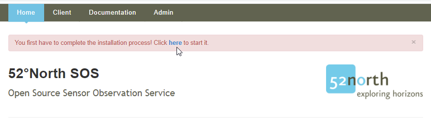

### Step 2 - Click "Start" in the lower right corner

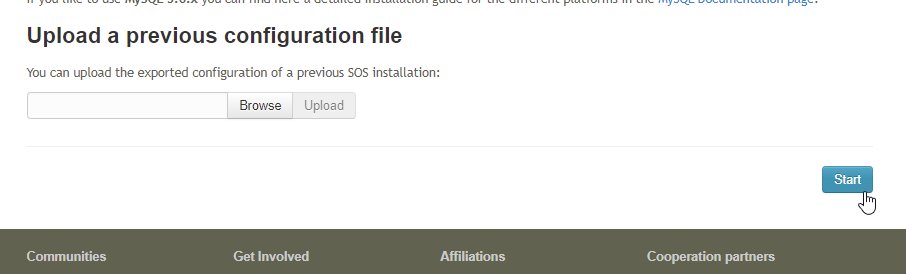

### Step 3 - Select "Proxy Aquarius (in-memory)" as the datasource, then click "Next"

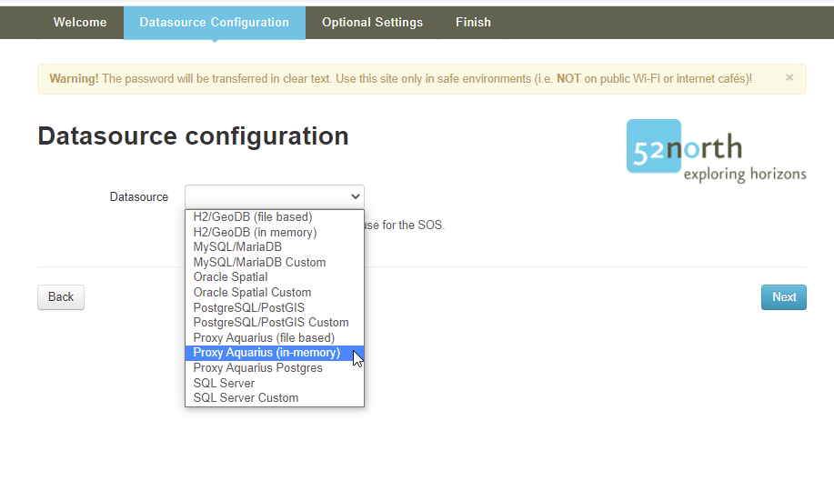

### Step 4 - Enter the AQTS URL and credentials, then click "Next"

Here you will enter the URL of your AQTS server, plus an AQTS credential account and password that the SOS proxy will use to access the AQTS APIs to obtain its data.

It is recommended that the AQTS account is configured for read-only access to the system, to limit the chance that any data will be changed in your core AQTS system.

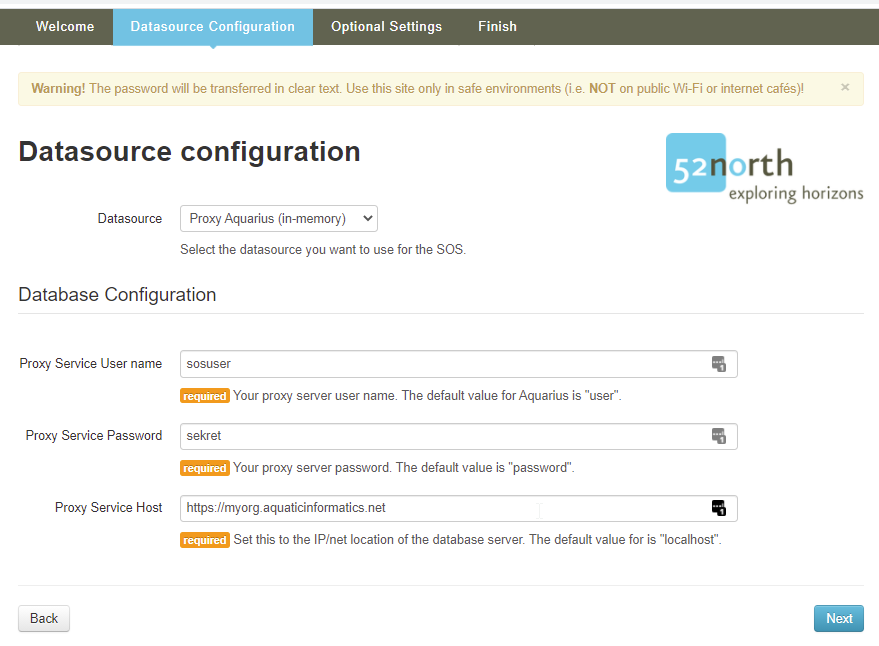

### Step 5 - Configure the "Proxy" settings to control the SOS polling frequency

The "Proxy" setting group has two properties which control the frequency at which the SOS proxy polls the AQTS system for new information.

These properties are [Unix cron expressions](https://www.freeformatter.com/cron-expression-generator-quartz.html#cronconverttotext), which are a common way of configuring periodic operations.

| Property | Default value | Description |
|---|---|---|
| Full Update | `0 0 03 * * ?`<br/>Every day at 3 AM | The full list of exported locations and time-series is refetched from AQTS. A full update takes longer to complete, but will take into account any deleted time-series or locations. |
| Temporal Update | `0 0/5 * * * ?`<br/>Every 5 minutes | And incremental "changes-since" poll of exported locations and time-series. |

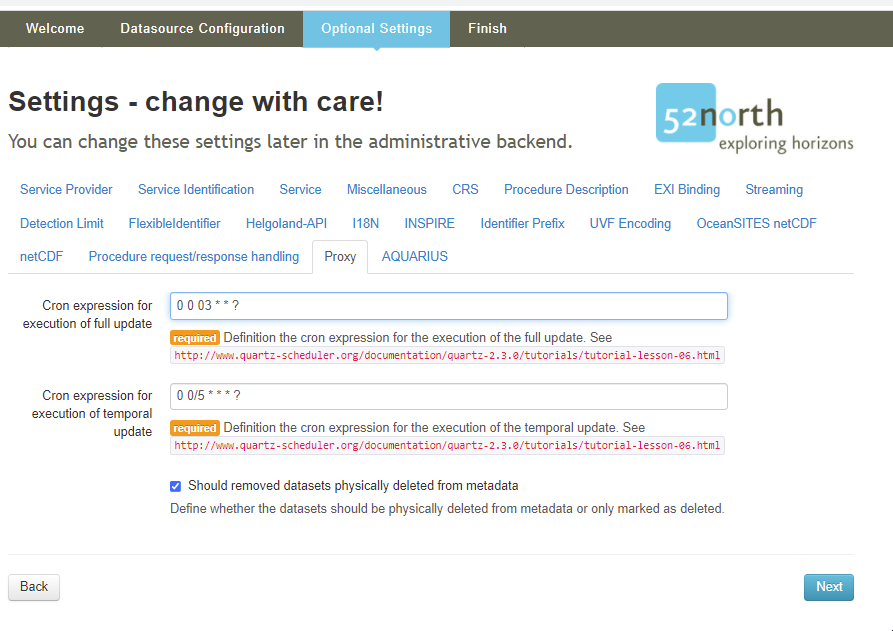

### Step 6 - Configure how time-series points are reported via SOS.

The "AQUARIUS" section of settings includes configuration options for:
- Which signal, corrected points or raw points, is exposed.
- Which AQTS qualifiers, if any, represent below/above sensor detection limits.
- Which additional AQTS qualifiers should be provided.

### Step 6 - Configure the "AQUARIUS" settings to filter which locations and time-series are exposed via SOS.

This section of settings controls which location and time-series from your AQTS system are exposed and made available for SOS queries.

By default, every location and time-series in your system will be exposed to SOS, but a number of configurable options are available to filter only a subset of locations and time-series.

Two types of filters are configurable:
- Extended attribute filters
- Publish flag filters

When both filters are configured, they will act as an "AND" operation and both conditions must match for a location or time-series to be exposed via SOS.

#### Step 6A - Configure location and/or time-series extended attributes filters

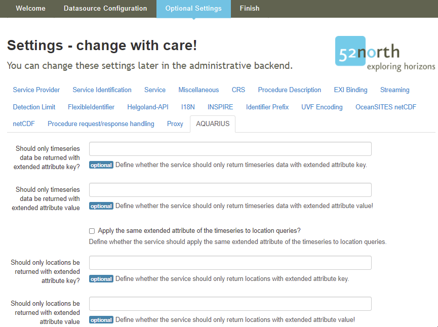

By default, no extended attribute values are used to filter locations or time-series, but many AQTS systems will use specific extended attribute values to indicate that a location or time-series should be exposed to the SOS proxy.

The configuration section allows for:
1) No extended attribute filters at all (the default configuration).
2) Only filter time-series via an extended attribute value (all locations will be exposed).
3) Filter time-series and locations by the same extended attribute value.
4) Filter time-series with one extended attribute value and locations with a different extended attribute value.

For systems that were previously configured to use the `SosExporter.exe`, option 2 makes sense, since the `ExportToSos` time-series extended attribute would have a value of 'Yes' when the series was exposed to SOS.

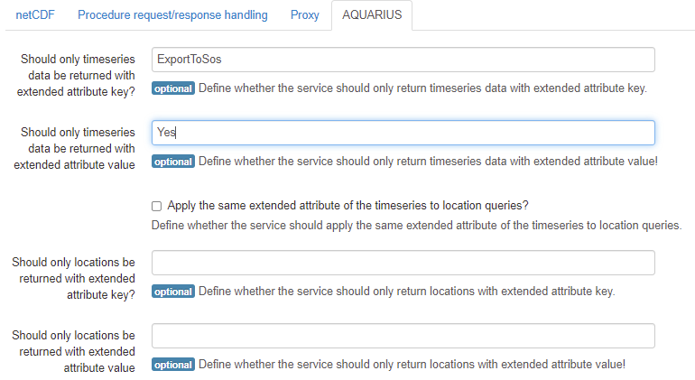

#### Step 6B - Filter by Publish=true or Publish=false

The default configuration is **All** which does not use the location/time-series Publish flag to filter exposed items.

Many AQTS systems use the Publish flag to control which items are exposed to their AQUARIUS Web Portal system, so if you are running both Web Portal and the SOS proxy, you will probably need a different filter (via extended attributes) to limit the data exposed to SOS.

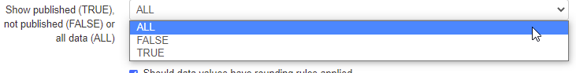

#### Step 6C - Corrected or Raw time-series points

The default configuration is **Corrected** and AQI strongly recommends keeping this default value.

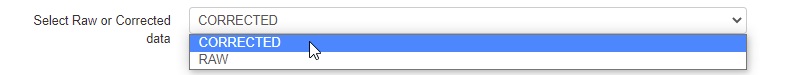

#### Step 6D - Configure qualifiers to indicate above/below sensor detection limits

Many water quality sensors have minimum detection limits, and some have maximum detection limits. The SOS proxy can report WaterML 2 standard above/below sensor limits by configuring the AQTS qualifier used to represent either condition.

When your time-series has points with these qualifiers applied, the SOS points will indicate the appropriate condition.

If your AQTS system uses qualifiers to represent these conditions, then you can enter the identifer of the qualifiers here.

So this AQTS qualifier configuration ...

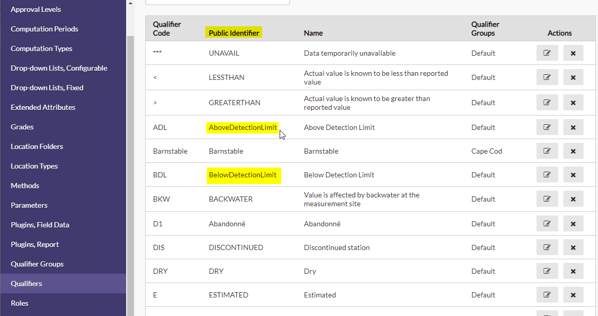

Would be configured like this in the SOS proxy.

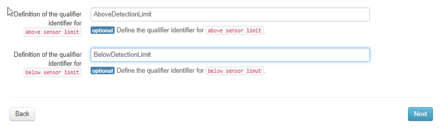

Note that the "Public Identifier" is used, not the "Qualifier Code" (so "AboveDetectionLimit" and not "ADL")

### Step 6E - Optional configuration of additional qualifiers

Here you can define additional qualifiers that should be considered by the service and added to the OGC WaterML 2.0 output.

Default value: _Recreational,Recreational Repeats_

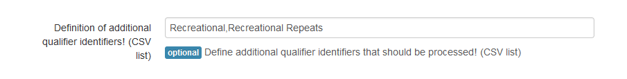

### Step 7 - Click "Next" to complete the Setup Wizard.

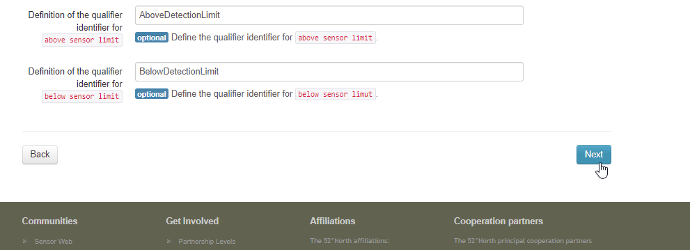

### Step 8 - Add the SOS admin credentials and click "Install"

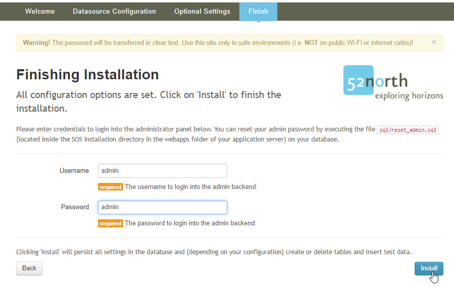

### Step 9 - Login as the SOS admin

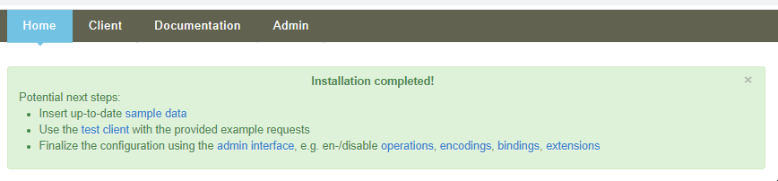

Use the credentials you added in Step 8 to log into the SOS server in the "Admin" menu.

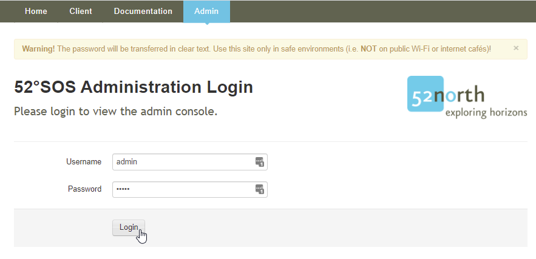

### Step 10 - Select the Admin => Settings => Profiles menut

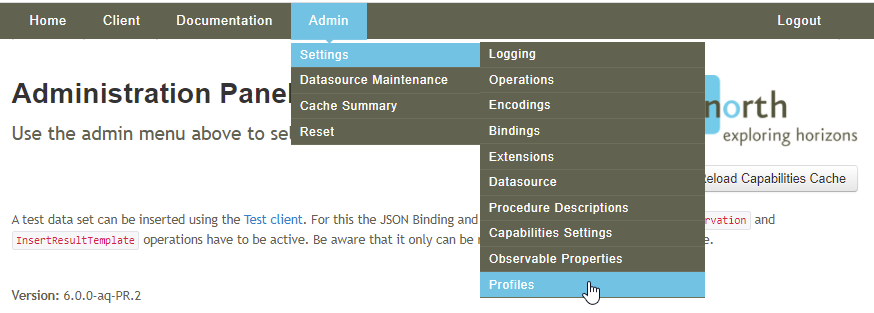

### Step 11 - Select the "hydrology" profile and click "Activate Profile!" to enable WaterML 2 output

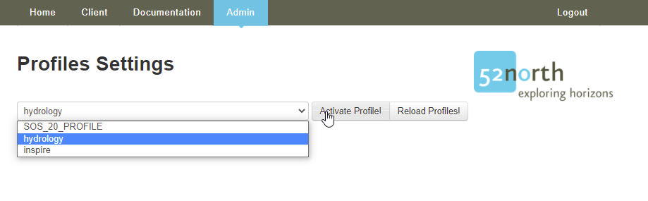

### Step 12 - Wait a few minutes for the initial discovery of exported series

Once Step 11 is complete, the SOS proxy will begin polling your AQTS system to discover the time-series matching the configuration you specified in Step 6.

This step make take a few minutes to finish discovering the exported series.

You will know the series discovery phase is complete when the GetDataAvailability request responds with a non-empty list.

## Stopping and restarting the docker container

Once the configuration is complete, the containers can be stopped and restarted using standard Docker commands, or via the Docker Dashboard GUI.

```sh
$ docker-compose down
```

Every time the container is restarted, it will need to re-discover the exported series and load them into memory, just like in Step 12.
