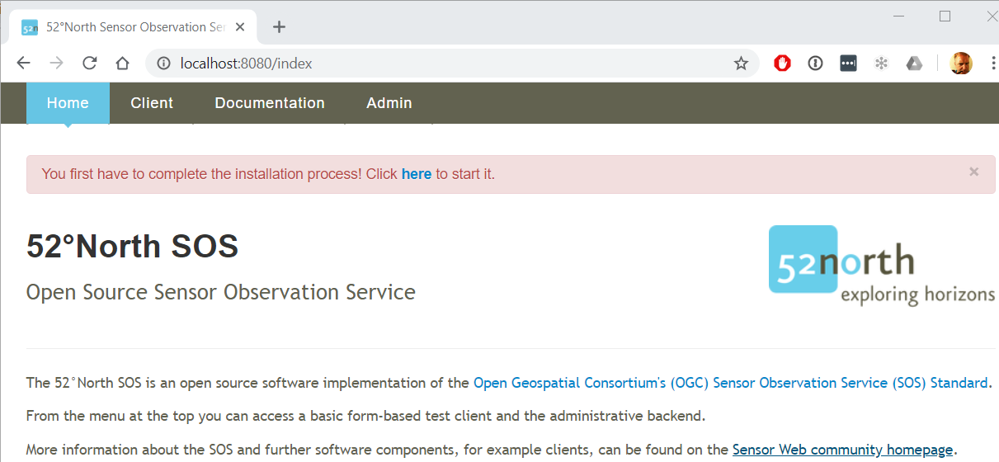
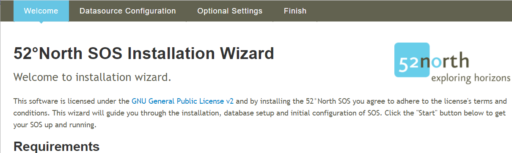
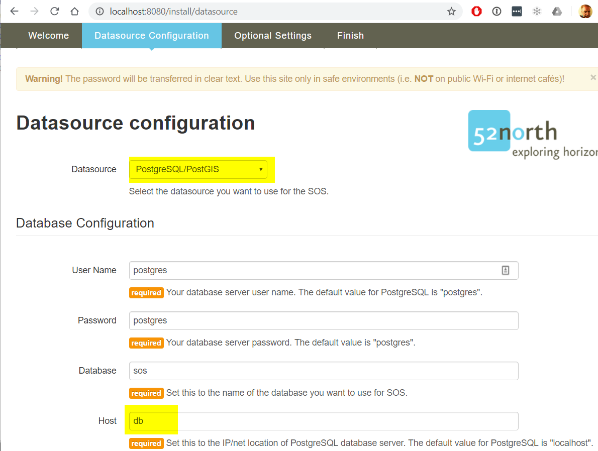
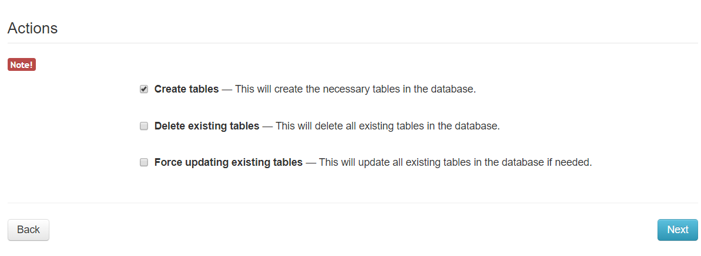
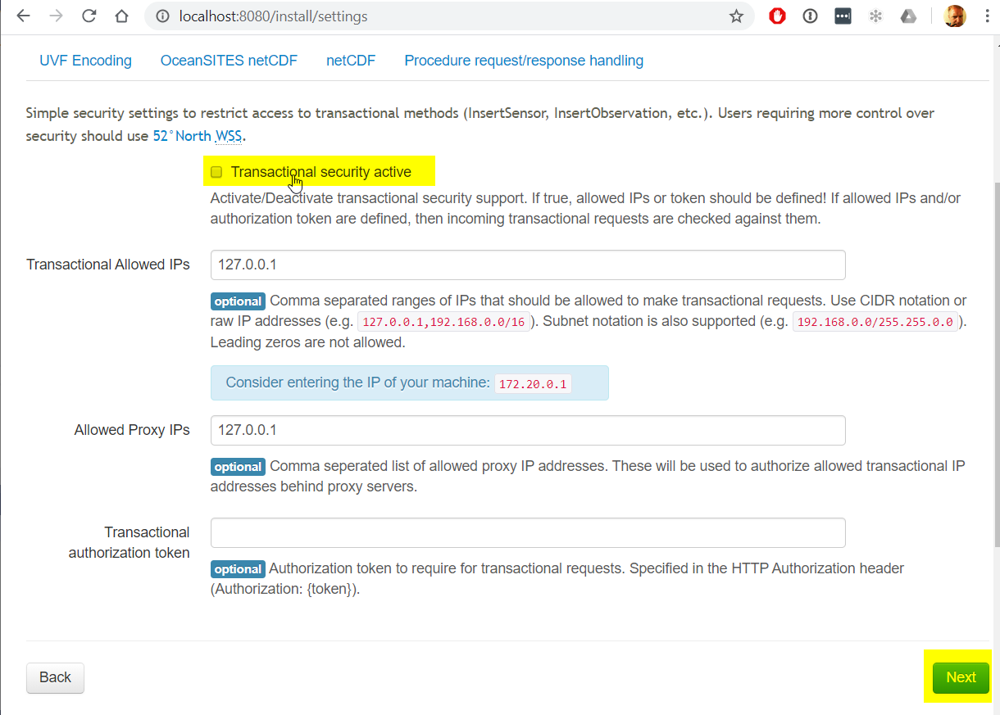
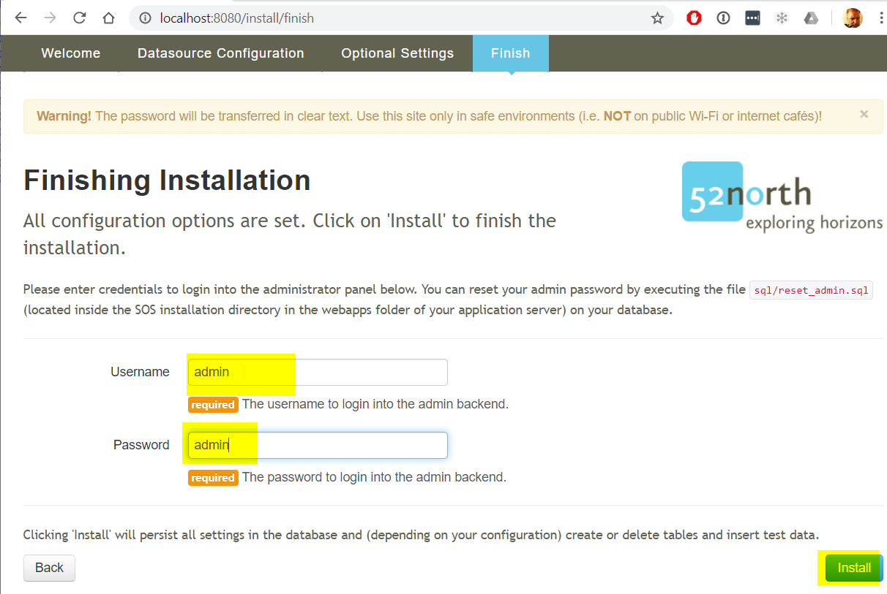
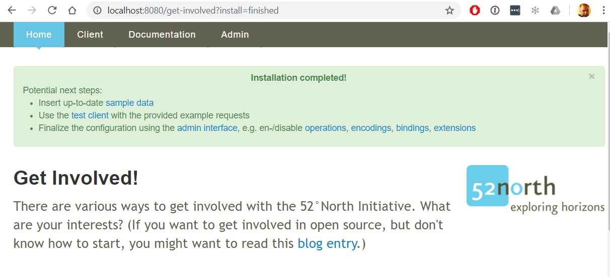

# Docker configuration of SOS server

This document describes how to use the [52North SOS](https://hub.docker.com/r/52north/sos/) container to hold and serve OGC time-series data.

Requires:
- [Docker Compose](https://docs.docker.com/compose/install/) v1.25+
- [Docker Engine](https://docs.docker.com/install/) v18+
- The contents of the [docker-compose](./docker-compose) folder, which has two files:
  - `docker-compose.yml` to configure the three docker containers
  - `ngix-proxy.conf` to configure the nginx reverse proxy

# Starting/stopping the Docker containers

Start the docker containers using the `docker-compose` command, in the same folder as the `docker-compose.yml` file:

```sh
$ docker-compose up
```

You can stop the containers too, either by typing Ctrl-C, or starting a new console and using the `down` command.

```sh
$ docker-compose down
```

## First-time setup

Before you can feed the SOS server with time-series data, the SOS server must be configured.

Browse to http://localhost/ to load the stock 52North interface:



Click on the red **here** link to start the configuration sequence.



Click the **Start** button in the lower right corner


Select the "PostgreSQL/PostGIS" option and change the host to "db"



Click the **Next** button at the bottom of the page.



Select the **Transactional Security** tab


Disable the **Transactional security active** checkbox and click **Next**



Enter an admin username and password and click **Install**



Your SOS server configuration is complete.

