# WaterWatchPreProcessor.exe

Download the latest version from [here](https://github.com/AquaticInformatics/examples/releases/latest).

The `WaterWatchPreProcessor.exe` is a console utility to extract time-series data from sensors in a [WaterWatch.io](https://www.waterwatch.io/) organisation account.

The sensor data can be processed by [AQUARIUS EnviroSCADA](https://aquaticinformatics.com/products/aquarius-enviroscada/), AQUARIUS DAS, or AQUARIUS Connect and appended to a time-series in [AQUARIUS Time-Series](https://aquaticinformatics.com/products/aquarius-time-series/).

`WaterWatchPreProcessor.exe` is a stand-alone EXE. It requires no installer and can be run from any folder.

## Configuration options

The tool supports the [common command line options](https://github.com/AquaticInformatics/examples/wiki/Common-command-line-options) pattern used by many AQTS utilities, which gives you some flexibility for configuring your integration.

At a minimum, this tool needs three pieces of information from your WaterWatch account, which can be found in the [Settings/APIs & Integration](https://help.waterwatch.io/article/20-waterwatch-rest-api-documentation) menu of the WaterWatch web application:
- `/WaterWatchOrgId=<orgId>` - Organisation ID
- `/WaterWatchApiKey=<apiKey>` - API Key
- `/WaterWatchApiToken=<apiToken>` - API Token

## Forcing a resync from a specific time

Use the `/SyncFromUtc=` option to force a resync of data from a specific time.

When not specified, the tool will sync from the last known time for each sensor.

## Filter sensors by regular expression

You can specify [.NET regular expressions](http://regexstorm.net/tester?p=WW&i=WWSensor1%0aSensor2%0aWWSensor3) to filter the list of exported sensors by patterns in the sensor name or sensor serial text properties.

Use the `/SensorName=regex` option to filter by the sensor name.

Use the `/SensorSerial=regex` option to filter by the sensor serial number.

The `regex` regular expression just needs to match a portion of the text property being filtered. So `/SensorName=Public` will match all sensors with a name containing the phrase "Public".

- Regular expressions perform case-sensitve matching.
- More than one `/SensorName=regex` or `/SensorSerial=regex` filter option can be specified on the command line or in a configuration file.
- Each filter operates as either an **inclusion** or **exclusion** filter.
- A filter is assumed to be an **inclusion** filter, unless the `regex` value begins with a minus-sign.
- If no **inclusion** filters are specified, all sensors will be included by default.

This pattern of inclusion and exclusion filtering can be used to precisely control which sensors are exported.

Eg. Export all the sensors starting with "Public", except for serial number "ABC123":

```cmd
WaterWatchPreProcessor /SerialName=^Public /SensorSerial="-^ABC123$" (other options ...)
```

## `/OutputMode=OffsetCorrected` is enabled by default

The value reported for each sensor will be the [offset-corrected value](https://help.waterwatch.io/article/23-what-is-the-offset-and-how-do-i-set-it-up), if the sensor has been configured with an offset.

`OffsetCorrectedValue = Offset - RawDistance;`

Use `/OutputMode=RawDistance` to always show the sensor's rawDistance value.

## Output text stream format

Each time the tool runs, it queries the WatchWatch API for any new measurements.

Each new measurement will be output to standard out as the following CSV stream:

```csv
Iso8601UtcTime, SensorType, SensorSerial, Value
2018-12-31T14:35:00.000Z, LS1, 418892, 92.23456
2018-12-31T14:37:00.000Z, LS1, 40AD1C, 289.47586
```

## Integrating with AQUARIUS Connect, or AQUARIUS EnviroSCADA, or AQUARIUS DAS

The integration for the family of AQUARIUS data ingest products share some common configuration.

In this example, we will map 3 [WaterWatch LS1 Remote Water Level](https://www.waterwatch.io/ls1-features) sensors to 3 "Stage" time-series, each in a separate AQUARIUS Time-Series location, using a time-series identifier pattern of "Stage.Telemetry@WW-$Serial".

| Sensor Serial | Sensor Name | AQUARIUS Time-Series identifier |
| --- | --- | --- |
| 40AD1C | Suncorp Stadium | Stage.Telemetry@WW-40AD1C |
| 3F8961 | Bulimba | Stage.Telemetry@WW-3F8961 |
| 416D19 | Flinders Pde | Stage.Telemetry@WW-416D19 |

On the Connect/EnviroSCADA/DAS app-server, create a `C:\WaterWatch` folder containing the following files:

| File | Description |
| --- | --- |
| `C:\WatchWatch\WaterWatchPreProcessor.exe` | The preprocessor executable. |
| `C:\WatchWatch\Config.txt` | An [@options.txt](https://github.com/AquaticInformatics/examples/wiki/Common-command-line-options#use-the-filenameext-syntax-to-specify-options-in-a-text-file) file containing your WaterWatch.io credentials.<br/><br/>Connect and EnviroSCADA will set the preprocessor argument to `@C:\WatchWatch\Config.txt`, with a `@` at the start. |
| `C:\WatchWatch\DummyFile.txt` | A simple file, whose contents don't matter. It can be empty or contain anything. The file just needs to exist. |

- **Note:** - The containing folder (`C:\WaterWatch` in this example) should not contain any spaces. This will avoid problems trying interpret preprocessor arguments when the preprocessor executable is launched in a separate process.

The following 10-line `Config.txt` file is a good starting point for a WaterWatch integration.

```
# WaterWatch.io credentials (replace with your actual values)
/WaterWatchOrgId=yourOrganisationId
/WaterWatchApiKey=yourApiKey
/WaterWatchApiToken=yourApiToken

# Force the saved state to a known location in the C:\WaterWatch folder
/SaveStatePath=C:\WaterWatch\NextMeasurementTimes.json

# By default, all sensors in your organisation will be polled for changes.
# Add /SensorName or /SensorSerial filters if you need something more precise.
```

### Configuring AQUARIUS Connect to consume the output stream

This configuration works with AQUARIUS Connect 2019.1 and greater.

1) Create a Connector with an Extraction Driver of "Text File Extraction Driver" and an Inbound Connection Driver of "File System Inbound Connection Driver".

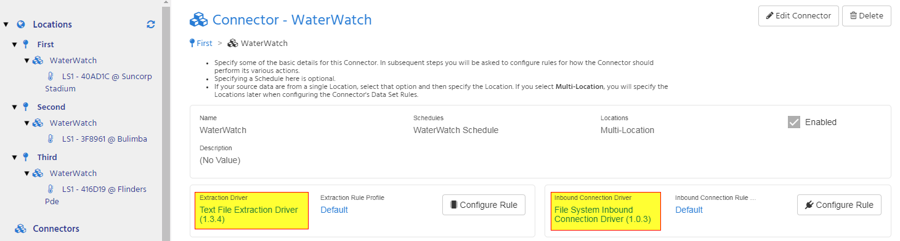

2) Configure the Extraction Rule, setting the rule's **Text parsing expression** to the [required regular expression](#The-regular-expression-matching-this-output-stream).

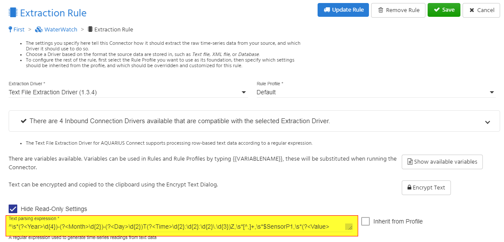

3) Configure the Inbound Connection Rule

   - Set `C:\WaterWatch\DummyFile.txt` as the single **Source path** to monitor.


   - Configure the Pre-Extraction File Processing settings:
       - Set the **Executable path** to `C:\WaterWatch\WaterWatchPreprocessor.exe` to run this preprocessor.
       - Set the **Executable arguments** to `@C:\WaterWatch\Config.txt`. Note the leading `@` character right before the config file path.
       - Set the **Executable timeout** to 5 minutes.

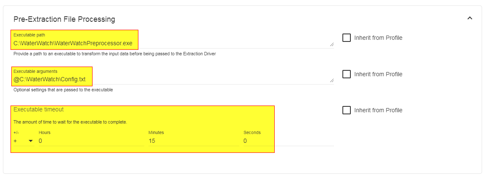

4) Schedule the connector to run every 15 minutes, or at your desired frequency.

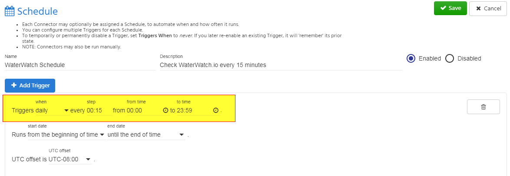

Repeat steps 4 through 8 for each sensor to export into AQTS:

5) In AQTS, create the location and the Stage time-series
- Create a location, using the "WW-$Serial" pattern for the **Location identifier**
- Create a time-series in that location, with a **Parameter** of "Stage", a **Label** of "Telemetry", and **Units** of "mm".

6) In Connect, create a location for the sensor
- Set the location's **Identifier** property to the same value as the AQTS location identifier.

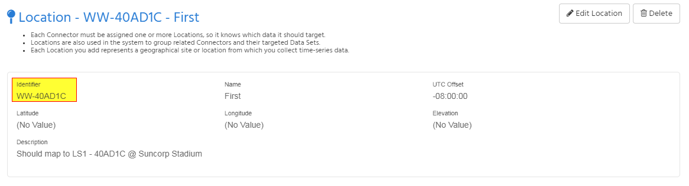

7) Create a Data Set Rule for each WaterWatch sensor.
- Set the data set rule's **DataSetIdentifier** to the sensor's serial number. This will allow the `$SensorP1` token to match the configured sensor.

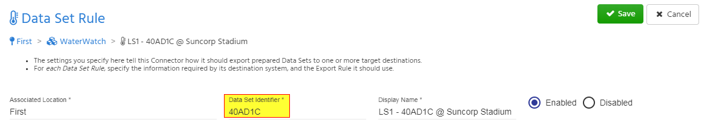

8) Create an Export Target for the data set which matches the AQTS location, parameter, and label of the target time-series.

- The export target will use the "AQUARIUS Time-Series Export" and "HTTP Outbound Connection" drivers.
- Set 4 common properties in the export rule profile, and make sure individual rules cannot override these values.
    - Set the **Parameter identifier** to "Stage".
    - Set the **Time-series label** to "Telemetry".
    - Leave the **Location identifier** blank.
    - Leave the **Write mode** as "Append without overwrite".
- The export rule profile will only need to be configured when the first sensor is added.
- All other sensors will be able to simply use this export rule profile without modification.

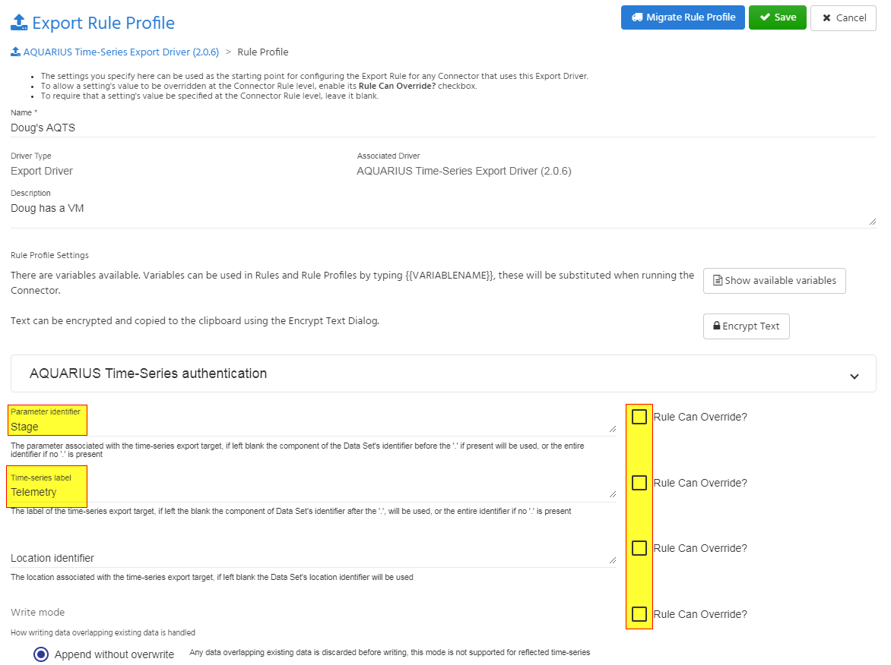

Now your Connect system will be polling the WaterWatch.io system every 15 minutes, and appending any new measurements to the appropriate sensor time-series.

### Configuring EnviroSCADA to consume the output stream

This configuration works with AQUARIUS EnviroSCADA 2017.1 and greater.

1) Add a new "WaterWatch" file format to the `[Device:TextFileReader]` section of `DriverDataLogger.ini`

For EnviroSCADA 2019.1-or-newer:

```ini
[Device:TextFileReader]
; ... existing file format settings ...
; These settings are for EnviroSCADA 2019.1-or-newer
WaterWatch.FileFormat=^\s*(?<Year>\d{4})-(?<Month>\d{2})-(?<Day>\d{2})T(?<Time>\d{2}:\d{2}:\d{2}\.\d{3})Z,\s*[^,]+,\s*$SensorP1,\s*(?<Value>.+)\s*$
WaterWatch.PreProcessorExe=C:\WaterWatch\WaterWatchPreProcessor.exe
WaterWatch.FolderPath=C:\WaterWatch
WaterWatch.FileFilter=DummyFile.txt
WaterWatch.CopyFilesLocally=false
WaterWatch.IgnoreLastUnload=true
```

For EnviroSCADA 2018.1-or-earlier, the INI changes are slightly different:

```ini
[Device:TextFileReader]
; ... existing file format settings ...
; These settings are for EnviroSCADA 2018.1-or-earlier
PreProcessorExe=C:\WaterWatch\WaterWatchPreProcessor.exe
FileFormat.WaterWatch=^\s*(?<Year>\d{4})-(?<Month>\d{2})-(?<Day>\d{2})T(?<Time>\d{2}:\d{2}:\d{2}\.\d{3})Z,\s*[^,]+,\s*$SensorP1,\s*(?<Value>.+)\s*$
HaltOnInvalidRows=true
CopyFilesLocally=false
IgnoreLastUnload.WaterWatch=true
```

The `C:\Program Files\Schneider Electric\ClearSCADA\EnviroSCADA\DriverDataLogger.ini` file is only read once when the "DataLogger" module starts up.

Once the INI file is updated, either restart the ClearSCADA server, or use the "ClearSCADA Server Status" tool to restart only the "DataLogger" driver.

2) Launch ViewX to create one Datalogger object containing all the WaterWatch sensors

In this example, we'll create a Group object named "Water Watch", containing:
- One Datalogger object, which controls the schedule and invokes the preprocessor
- A Group object named "Sensors", contain a hierarchy of location Groups and Analogue Point objects

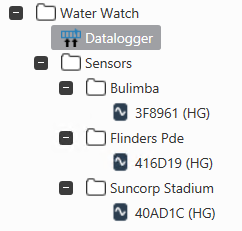

3) Create the one Datalogger object to control the polling schedule

- Set the **Scan Rate** to the desired frequency (eg. "15M" for a 15-minute polling schedule)
- Set the **Device Type** to `TextFileReader`
- Set the **Logger Setup** string to a version-specific setup string:

| EnviroSCADA version | **Logger Setup** value |
| --- | --- |
| 2019.1 and newer | `Format=WaterWatch PreProc=C:\WaterWatch\Config.txt` |
| 2018.1 and earlier | `Format=WaterWatch PreProc=C:\WaterWatch\Config.txt MoveFile=False File=C:\WaterWatch\DummyFile.txt` |

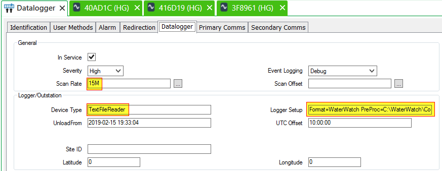

Repeat steps 4 through 6 for each sensor to export into AQTS:

4) Create a Group object named after the AQTS location and add one Analogue Point object into the group.

- Set the **DataLogger** to the Datalogger object created in step 3
- Set the **Logger Sensor** to the serial number of the WaterWatch sensor

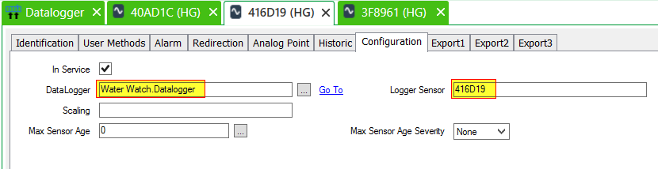

5) Configure the Analogue Point to export values to the AQTS time-series

- Set the **Target System** to "AQUARIUS"
- Set the **Target Series ID** to the time-series identifier

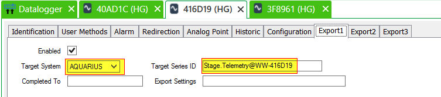

6) Enable historic data for the Analogue Point

- Be sure to enable ClearSCADA historic data for the new Analogue Point

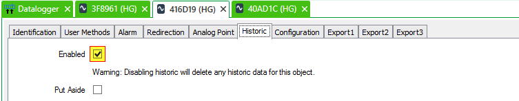

Now your EnviroSCADA system will be exporting WaterSensor measurements into your AQUARIUS Time-Series system.

## The regular expression matching this output stream

Use the following regular expression to parse the text output stream of this preprocessor.

```regex
^\s*(?<Year>\d{4})-(?<Month>\d{2})-(?<Day>\d{2})T(?<Time>\d{2}:\d{2}:\d{2}\.\d{3})Z,\s*[^,]+,\s*$SensorP1,\s*(?<Value>.+)\s*$
```

That cryptic expression has the following meaning:

| Expression | Meaning |
| --- | --- |
| `^` | Beginning of line. |
| `\s*` | Whitespace, zero or more repetitions. |
| `(?<Year>\d{4})` | The named capture group "Year".<br/>4 digits. |
| `-` | A literal dash. |
| `(?<Month>\d{2})` | The named capture group "Month".<br/>2 digits. |
| `-` | A literal dash. |
| `(?<Day>\d{2})` | The named capture group "Day".<br/>2 digits. |
| `T` | A literal letter T (the ISO 8601 standard for separating dates from times). |
| `-` | A literal dash. |
| `(?<Time>\d{2}:\d{2}:\d{2}\.\d{3})` | The named capture group "Time".<br/>24-hour time component.<br/>`HH:mm:ss.fff` format |
| `Z` | A literal letter Z (denoting the UTC timezone). |
| `,` | A literal comma. |
| `\s*` | Whitespace, zero or more repetitions. |
| `[^,]*` | Sensor type field.<br/>Any character except a comma, zero or more repetitions. |
| `,` | A literal comma. |
| `\s*` | Whitespace, zero or more repetitions. |
| `$SensorP1` | The special `$SensorP1` token is replaced with the value of the Connect "DataSetIdentifier" or EnviroSCADA "Logger Sensor" property, which should be configured to be the serial number of the WaterWatch sensor. This allows the regular expression to be run once per sensor, and only lines with measurements from the a specific sensor will be extracted.|
| `,` | A literal comma. |
| `\s*` | Whitespace, zero or more repetitions. |
| `(?<Value>.+)` | The named capture group "Value".<br/>The sensor value.<br/>One or more characters. |
| `\s*` | Whitespace, zero or more repetitions. |
| `$` | End of line. |

## `/help` screen

```
Extract the latest sensor readings from a https://waterwatch.io account

usage: WaterWatchPreProcessor [-option=value] [@optionsFile] ...

Supported -option=value settings (/option=value works too):

  ===================== https://waterwatch.io credentials
  -WaterWatchOrgId      WaterWatch.io organisation Id
  -WaterWatchApiKey     WaterWatch.io API key
  -WaterWatchApiToken   WaterWatch.io API token

  ===================== Configuration options
  -OutputMode           Measurement value output mode. One of OffsetCorrected, RawDistance. [default: OffsetCorrected]
  -SaveStatePath        Path to persisted state file [default: WaterWatchSaveState.json]
  -SyncFromUtc          Optional UTC sync time. [default: last known sensor time]
  -NewSensorSyncDays    Number of days to sync data when a new sensor is detected. [default: 5]

  ===================== Sensor filtering options
  -SensorName           Sensor name regular expression filter. Can be specified multiple times.
  -SensorSerial         Sensor serial number regular expression filter. Can be specified multiple times.

Supported /SyncFromUtc date formats:

  yyyy-MM-dd
  yyyy-MM-ddTHH:mm
  yyyy-MM-ddTHH:mm:ss
  yyyy-MM-ddTHH:mm:ss.fff

Use the @optionsFile syntax to read more options from a file.

  Each line in the file is treated as a command line option.
  Blank lines and leading/trailing whitespace are ignored.
  Comment lines begin with a # or // marker.
```
