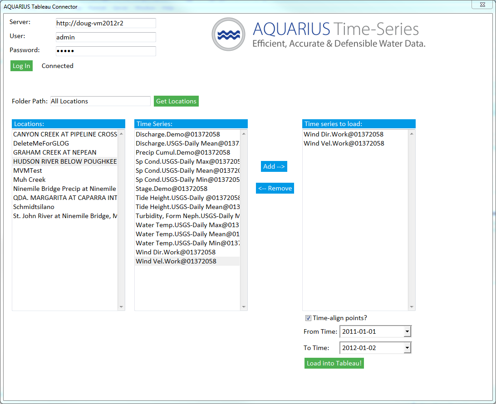

## Tableau Connector for AQUARIUS Time-Series

[**Download** this project folder](https://minhaskamal.github.io/DownGit/#/home?url=https:%2F%2Fgithub.com%2FAquaticInformatics%2FExamples%2Ftree%2Fmaster%2FTimeSeries%2FPublicApis%2FTableauConnector)

## Pre-requisites
- AQUARIUS Time-Series 2017.2+ installed on an app server
- Admin rights to the AQTS app server
- Tableau Desktop or Tableau Public, v10.2+

## Installation of the Tableau Connector

The Tableau web connector is a set of static HTML and Javascript files, to be deployed on the AQTS app server as an IIS virtual folder in the `/TableauConnector/` route.

Extract the `TableauConnector.zip` archive to  `C:\inetpub\wwwroot\TableauConnector` on the AQTS app server. IIS will automatically detect the folder underneath `wwwroot` and serve up its content from the `/TableauConnector/` route.

## Using the connector from within Tableau

From Tableau Desktop/Tableau Public:
- Select `Connect` => `Web Data Connector` and browse to `http://yourserver/TableauConnector`
- Enter your credentials and click the `Log In` button.
- Click the `Get Locations` to load all the locations (or filter by location path).
- Select a location from the `Locations:` list.
- Select one or more time-series from the `Time Series:` list and click the `Add-->` button.
- Repeat the time-series selection sequence for other locations if desired.
- Enter an optional start time and end time in the `From Time:` and `To Time:` selectors.
- Click the `Load into Tableau!` button to load the data from the selected time-series into Tableau.
- The selected time-series and time-range will be saved in your Tableau workbook.

Now you can explore your data within Tableau!

### Specifying a time-range of data to retrieve

- The `From Time:` and `To Time:` selectors are optional.
- If no `From Time:` value is specified, the beginning of the time-series record is used
- If no `To Time:` value is specified, the end of the time-series record is used.
- Leave both values blank to retrieve the entire time-series record.

Supported date time formats:
- `yyyy-MM-dd` (assumes the UTC timezone)
- `yyyy-MM-ddTHH:mm` (and optional `ZZZ` timezone)
- `yyyy-MM-ddTHH:mm:ss` (and optional `ZZZ` timezone)
- `yyyy-MM-ddTHH:mm:ss.fffffff` (and optional `ZZZ` timezone)

`ZZZ` timezone offsets are one of:
- a literal `Z` for UTC
- `+HH:mm`
- `-HH:mm`

### Time-aligning point values

The `Time-align points?` checkbox is enabled by default.

When enabled, the points from all time-series will be aligned to the time-stamps of the first (topmost) time-series in the `Time-series to load:` list.
The standard AQUARIUS Time-Series interpolation rules will be applied when aligning the point values.

When disabled, points from each time-series will be retrieved at their native resolution, with no interpolation applied.

When only one time-series is being retrieved, the checkbox setting has no effect.

## Tables exported to Tableau

| Table name| Description |
|---|---|
|Locations| The locations matching the `FolderPath` filter. |
|Time Series| The metadata for the time-series in the `Time-series to load` list. |
|Time Series Points| The points, approvals, and grades retrieved from the selected time-series. |

## Roadmap for the Web Connector
- Add optional unit-conversion support (since the underlying `GET /GetTimeSeriesData` API supports unit-conversion)
- Add the AQTS configuration data (all parameters, units, approval levels, grades, and qualifiers) as exported Tableau tables, for easier filtering and legends.